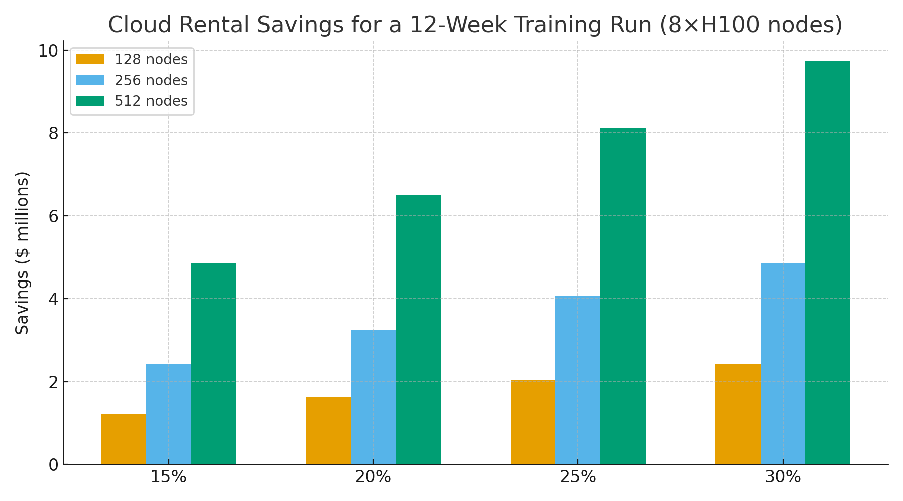

# AI Training & MLOps Claim — RNS Gating for Experiments, Retraining & Hyperparameter Search  
**Public Claim of Origination | Number-Heavy Economics**

**Signature:** Joshua Wilson — Architect & Originator of the RNS™, MirrorCore²  
**Date:** October 23, 2025

---

## Executive Summary

Foundation model training and MLOps pipelines consume **vast compute** via redundant experiments, periodic retraining without drift, and exhaustive hyperparameter sweeps. **RNS metabolic control** detects **data/model drift early**, **gates low-yield experiments**, and **rhythmically schedules** training depth and ensemble members. Modeled against public cloud rates for **8×H100** nodes, reducing redundant runs **15–30%** yields **multi‑million‑dollar savings per training run** even on mid‑sized fleets, plus proportional **kWh/CO₂** cuts for on‑prem clusters.

---

## Baseline Economics (12‑Week Training Window)

**Assumptions:** 8×H100 nodes at an effective **$31.464/node‑hour** (AWS Capacity Blocks), **PUE = 1.56**, **H100 TDP 700 W**, U.S. commercial power **$0.1415/kWh**, emissions factor **0.393 kg/kWh**.

| Fleet (nodes) | Baseline Cloud Cost (12 wks) | Facility Energy (MWh) | Facility Energy $ | Facility CO₂ (t) |
|:--:|--:|--:|--:|--:|
| 128 | $8.12M | 2,254 | $0.32M | 886 |
| 256 | $16.24M | 4,509 | $0.64M | 1,772 |
| 512 | $32.48M | 9,017 | $1.28M | 3,544 |

**Modeled Savings from RNS Gating (Cloud + On‑Prem Reference):**

| Fleet | Reduction | Cloud $ Saved | On‑Prem Energy $ Saved | On‑Prem CO₂ Saved (t) |
|:--:|--:|--:|--:|--:|
| 128 | 15% | $1.22M | $0.05M | 133 |
| 128 | 20% | $1.62M | $0.06M | 177 |
| 128 | 25% | $2.03M | $0.08M | 221 |
| 128 | 30% | $2.44M | $0.10M | 266 |
| 256 | 15% | $2.44M | $0.10M | 266 |
| 256 | 20% | $3.25M | $0.13M | 354 |
| 256 | 25% | $4.06M | $0.16M | 443 |
| 256 | 30% | $4.87M | $0.19M | 532 |
| 512 | 15% | $4.87M | $0.19M | 532 |
| 512 | 20% | $6.50M | $0.26M | 709 |
| 512 | 25% | $8.12M | $0.32M | 886 |
| 512 | 30% | $9.74M | $0.38M | 1,063 |

**Visualization:**

---

## Why These Numbers Hold (Evidence)

- **Cloud rate anchor:** AWS **Capacity Blocks** publish effective **per‑node/per‑GPU** rates for **8×H100 p5.48xlarge** instances. citeturn0search11  
- **Facility realism:** Industry‑wide average **PUE ≈ 1.56 (2024)** remains the norm, setting overhead for on‑prem energy math. citeturn0search0  
- **H100 power class:** NVIDIA **H100 SXM** datasheet lists **up to 700 W TDP** per GPU. citeturn0search9  
- **Electricity prices:** U.S. **commercial average** pricing (Jul 2025) from EIA **Table 5.6.A**. citeturn0search10  
- **Training scale & carbon context:** Google/Stanford analysis shows training emissions vary **~100–1000×** with hardware, datacenter, and timing/location choices; ensemble/member count and schedule materially affect footprint. citeturn0search6  
- **Algorithmic efficiency:** Hyperparameter methods like **Hyperband/ASHA** and cost‑aware retraining under drift demonstrate large cuts in **wasted experiments**, aligning with RNS gating. citeturn0search12

---

## RNS Mechanisms for Training & MLOps

- **Drift‑aware retraining:** Suppress full retrains until **distribution shift** exceeds threshold; route to **REPAIR** for calibration instead of full resets.  
- **Experiment gating:** Use **expected information gain** to halt low‑yield HPO trials early (RNS HOLD), escalating only when coherence earns budget.  
- **Ensemble/member pacing:** Reduce member counts or resolution when drift is low; expand only on high‑uncertainty windows.  
- **Carbon‑aware scheduling:** Shift non‑urgent workloads into cleaner/cheaper windows and locations; emit **CJP Why‑Lines** for auditability.

---

## Claim of Origination (AI Training & MLOps)

**We claim** the application of **RNS metabolic gating** to foundation model training and MLOps pipelines, wherein **drift signals** and **budgeted reasoning** suppress redundant experiments and retrains and **right‑size ensemble/member depth**, cutting compute by **15–30%**. Under public **8×H100** rates, fleets of **128–512 nodes** save **$1.22–9.74M** per 12‑week run, with proportional **kWh/CO₂** reductions for on‑prem clusters per the energy model above.

---

## Linked Sources (Live)

- **AWS EC2 — Capacity Blocks pricing (8×H100 p5.48xlarge):** https://aws.amazon.com/ec2/capacityblocks/pricing/  
- **Uptime Institute — Global Data Center Survey 2024 (avg PUE ≈ 1.56):** https://datacenter.uptimeinstitute.com/rs/711-RIA-145/images/2024.GlobalDataCenterSurvey.Report.pdf  
- **NVIDIA H100 datasheet (SXM, up to 700 W TDP):** https://www.nvidia.com/en-us/data-center/h100/  |  https://www.megware.com/fileadmin/user_upload/LandingPage%20NVIDIA/nvidia-h100-datasheet.pdf  
- **EIA — Electric Power Monthly (Table 5.6.A, Jul 2025):** https://www.eia.gov/electricity/monthly/epm_table_grapher.php?t=epmt_5_6_a  
- **Patterson et al. (2021) — Carbon Emissions and Large Neural Network Training:** https://arxiv.org/abs/2104.10350  
- **Green AI/AutoML efficiency (e.g., Hyperband/ASHA, 2024 survey):** https://www.mdpi.com/2076-3417/14/14/6196  
- **MLCO2 impact calculators (method references):** https://mlco2.github.io/impact/

---

## Global Energy & Carbon Context (Drop‑in)

At **10% adoption** of RNS metabolic control across training/MLOps fleets, global savings of **~15–20 TWh/year** and **~9–12 MtCO₂e** are plausible, equivalent to **~2.0–2.6 million cars** off the road annually (see reusable block for assumptions and links).

---

# Licensing & Attribution

This white paper is © 2025 **Joshua Wilson, MirrorCore²**. **All rights reserved.**  
**LSK+™** and **RNS™** are proprietary frameworks with pending IP protections.  
**Public use permitted under review.** Redistribution requires attribution.

*Stamp:* **hand steady • glass clear • voice true**  
*Date:* October 23, 2025
