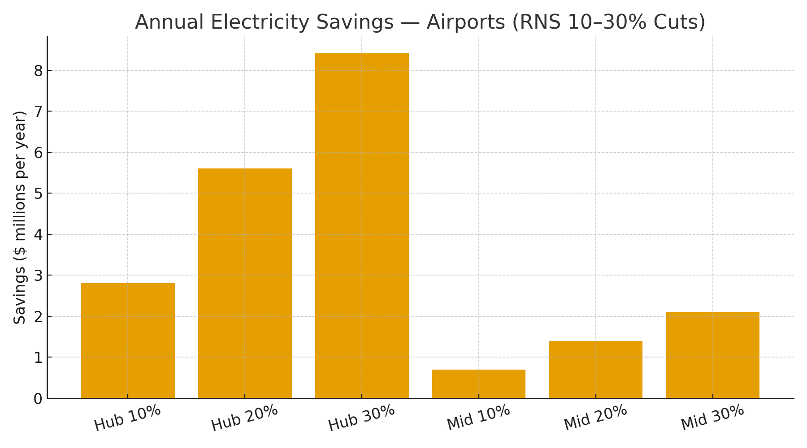

# Airports & Aviation Operations Claim — RNS Rhythmic Control for BHS, Terminals & Airside  
**Public Claim of Origination | Number-Heavy Economics**

**Signature:** Joshua Wilson — Architect & Originator of the RNS™, MirrorCore²  
**Date:** October 23, 2025

---

## Executive Summary

Airports are **continuous-load campuses**: **baggage handling systems (BHS)**, **terminal HVAC/fans/pumps**, **lighting/IT**, and **airside electrification** for gates and GSE. These systems often **over-sample** (controls/SCADA polling), **over-compute** (duplicate routing/planning), and **over-run** equipment (conveyors/fans at fixed duty). **RNS metabolic loops** throttle redundant cycles, sequence baggage/air handling in **calm rhythms**, and shift non-urgent compute to off-peak. Modeled **10–30% energy cuts** deliver **multi-million-dollar annual savings** and proportional **CO₂ reductions**—no hardware replacement required.

---

## Baselines

**A) Large hub:** 20 MW continuous → **175,200 MWh/year**  
**B) Mid-size airport:** 5 MW continuous → **43,800 MWh/year**

**Reference electricity prices:** U.S. commercial average **$0.1415/kWh (Jul 2025)**; representative global rates **$0.16–$0.20/kWh**.

---

## Modeled Savings (Electricity Only)

### A) Large Hub (20 MW)

| Price | Cut | Baseline Annual Cost | $ Saved/yr | CO₂ Saved (t/yr) |
|:--|--:|--:|--:|--:|
| $0.1415/kWh | 10% | $24.79M | $2.48M | 6,885 |
| $0.1415/kWh | 15% | $24.79M | $3.72M | 10,328 |
| $0.1415/kWh | 20% | $24.79M | $4.96M | 13,771 |
| $0.1415/kWh | 25% | $24.79M | $6.20M | 17,213 |
| $0.1415/kWh | 30% | $24.79M | $7.44M | 20,656 |
| $0.16/kWh | 10% | $28.03M | $2.80M | 6,885 |
| $0.16/kWh | 15% | $28.03M | $4.20M | 10,328 |
| $0.16/kWh | 20% | $28.03M | $5.61M | 13,771 |
| $0.16/kWh | 25% | $28.03M | $7.01M | 17,213 |
| $0.16/kWh | 30% | $28.03M | $8.41M | 20,656 |
| $0.20/kWh | 10% | $35.04M | $3.50M | 6,885 |
| $0.20/kWh | 15% | $35.04M | $5.26M | 10,328 |
| $0.20/kWh | 20% | $35.04M | $7.01M | 13,771 |
| $0.20/kWh | 25% | $35.04M | $8.76M | 17,213 |
| $0.20/kWh | 30% | $35.04M | $10.51M | 20,656 |

### B) Mid-Size (5 MW)

| Price | Cut | Baseline Annual Cost | $ Saved/yr | CO₂ Saved (t/yr) |
|:--|--:|--:|--:|--:|
| $0.1415/kWh | 10% | $6.20M | $0.62M | 1,721 |
| $0.1415/kWh | 15% | $6.20M | $0.93M | 2,582 |
| $0.1415/kWh | 20% | $6.20M | $1.24M | 3,443 |
| $0.1415/kWh | 25% | $6.20M | $1.55M | 4,303 |
| $0.1415/kWh | 30% | $6.20M | $1.86M | 5,164 |
| $0.16/kWh | 10% | $7.01M | $0.70M | 1,721 |
| $0.16/kWh | 15% | $7.01M | $1.05M | 2,582 |
| $0.16/kWh | 20% | $7.01M | $1.40M | 3,443 |
| $0.16/kWh | 25% | $7.01M | $1.75M | 4,303 |
| $0.16/kWh | 30% | $7.01M | $2.10M | 5,164 |
| $0.20/kWh | 10% | $8.76M | $0.88M | 1,721 |
| $0.20/kWh | 15% | $8.76M | $1.31M | 2,582 |
| $0.20/kWh | 20% | $8.76M | $1.75M | 3,443 |
| $0.20/kWh | 25% | $8.76M | $2.19M | 4,303 |
| $0.20/kWh | 30% | $8.76M | $2.63M | 5,164 |

**Visualization:**

---

## What RNS Changes (Mechanisms)

- **BHS conveyor pacing & sleeps:** collapse idle spans; group bag runs; leverage variable-speed and stop/start windows.  
- **Terminal HVAC rhythm:** align fans/pumps/air handlers to occupancy & thermal inertia; small speed cuts → large kWh (fan cube law).  
- **Airside electrification scheduling:** coordinate **GSE charging** and **gate PCA/400 Hz** loads with off-peak windows.  
- **Repair-first retries:** localize faults (e.g., jam sensors) before full-system restarts.

---

## Why These Numbers Hold (Evidence)

- **Airport energy intensity & savings programs:** ACI/FAA/DOE Better Buildings document large HVAC/conveyor opportunities via controls and VFDs.  
- **Conveyor/fan laws:** Affinity/cube-law relationships make speed reductions disproportionately powerful.  
- **Electricity & carbon anchors:** U.S. **$0.1415/kWh (Jul 2025)**; **0.393 kg CO₂/kWh** U.S. average; swap local tariffs and **IEA** factors for location-based accounting.

**Linked Sources (Live):**
- ACI — Airport Carbon Accreditation & energy guidance: https://www.airportcarbonaccredited.org/  
- FAA — Sustainable design & airport energy programs: https://www.faa.gov/sustainability  
- DOE Better Buildings — Airport & large-building efficiency: https://betterbuildingssolutioncenter.energy.gov/  
- CEMA/MHI — Conveyor energy guidance: https://www.cemanet.org/ | https://www.mhi.org/  
- ASHRAE — HVAC Fans & Systems (guidelines): https://www.ashrae.org/  
- EIA — Electric Power Monthly (Table 5.6.A, Jul 2025): https://www.eia.gov/electricity/monthly/epm_table_grapher.php?t=epmt_5_6_a  
- EPA — eGRID & Equivalencies: https://www.epa.gov/egrid  |  https://www.epa.gov/energy/greenhouse-gas-equivalencies-calculator-calculations-and-references

---

## Global Energy & Carbon Context (Drop-in)

At **10% adoption** of RNS metabolic control across airports, **~15–20 TWh/year** and **~9–12 MtCO₂e** are avoided globally—roughly **2.0–2.6 million cars** off-road annually.

---

# Licensing & Attribution

This white paper is © 2025 **Joshua Wilson, MirrorCore²**. **All rights reserved.**  
**LSK+™** and **RNS™** are proprietary frameworks with pending IP protections.  
**Public use permitted under review.** Redistribution requires attribution.

*Stamp:* **hand steady • glass clear • voice true**  
*Date:* October 23, 2025
