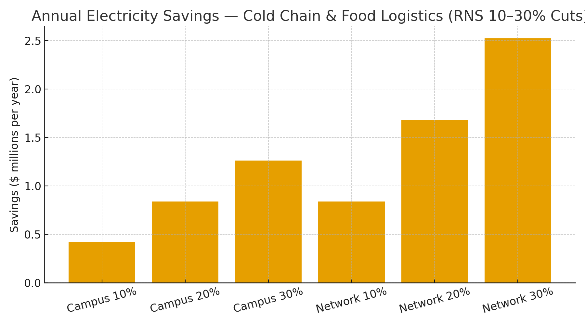

# Cold Chain & Food Logistics Claim — RNS Metabolic Control for Refrigeration & Routing  
**Public Claim of Origination | Number-Heavy Economics**

**Signature:** Joshua Wilson — Architect & Originator of the RNS™, MirrorCore²  
**Date:** October 23, 2025

---

## Executive Summary

Cold storage and food logistics are dominated by **refrigeration power** and **motor-driven systems** (fans, pumps, compressors), with edge compute for WMS/vision increasingly always-on. **RNS metabolic control** reduces **over-sampling/over-computing** and directly **paces equipment duty**: coordinated defrost, setpoint trims under stability, and **repair-first** actions to stop runaway cycling. Modeled **10–30% energy cuts** deliver **seven-figure annual savings** across campuses and regional networks.

---

## Baselines

**A) Refrigerated warehouse campus:** 3.0 MW continuous → **26,280 MWh/year**  
**B) Regional distribution network:** 6 × 1.0 MW → **52,560 MWh/year**

**Reference electricity prices:** U.S. commercial average **$0.1415/kWh (Jul 2025)**; representative global rates **$0.16–$0.20/kWh**.

---

## Modeled Savings (Electricity Only)

### A) Campus (3 MW)

| Price | Cut | Baseline Annual Cost | $ Saved/yr | CO₂ Saved (t/yr) |
|:--|--:|--:|--:|--:|
| $0.1415/kWh | 10% | $3.72M | $0.37M | 1,033 |
| $0.1415/kWh | 15% | $3.72M | $0.56M | 1,549 |
| $0.1415/kWh | 20% | $3.72M | $0.74M | 2,066 |
| $0.1415/kWh | 25% | $3.72M | $0.93M | 2,582 |
| $0.1415/kWh | 30% | $3.72M | $1.12M | 3,098 |
| $0.16/kWh | 10% | $4.20M | $0.42M | 1,033 |
| $0.16/kWh | 15% | $4.20M | $0.63M | 1,549 |
| $0.16/kWh | 20% | $4.20M | $0.84M | 2,066 |
| $0.16/kWh | 25% | $4.20M | $1.05M | 2,582 |
| $0.16/kWh | 30% | $4.20M | $1.26M | 3,098 |
| $0.20/kWh | 10% | $5.26M | $0.53M | 1,033 |
| $0.20/kWh | 15% | $5.26M | $0.79M | 1,549 |
| $0.20/kWh | 20% | $5.26M | $1.05M | 2,066 |
| $0.20/kWh | 25% | $5.26M | $1.31M | 2,582 |
| $0.20/kWh | 30% | $5.26M | $1.58M | 3,098 |

### B) Regional Network (6 × 1 MW)

| Price | Cut | Baseline Annual Cost | $ Saved/yr | CO₂ Saved (t/yr) |
|:--|--:|--:|--:|--:|
| $0.1415/kWh | 10% | $7.44M | $0.74M | 2,066 |
| $0.1415/kWh | 15% | $7.44M | $1.12M | 3,098 |
| $0.1415/kWh | 20% | $7.44M | $1.49M | 4,131 |
| $0.1415/kWh | 25% | $7.44M | $1.86M | 5,164 |
| $0.1415/kWh | 30% | $7.44M | $2.23M | 6,197 |
| $0.16/kWh | 10% | $8.41M | $0.84M | 2,066 |
| $0.16/kWh | 15% | $8.41M | $1.26M | 3,098 |
| $0.16/kWh | 20% | $8.41M | $1.68M | 4,131 |
| $0.16/kWh | 25% | $8.41M | $2.10M | 5,164 |
| $0.16/kWh | 30% | $8.41M | $2.52M | 6,197 |
| $0.20/kWh | 10% | $10.51M | $1.05M | 2,066 |
| $0.20/kWh | 15% | $10.51M | $1.58M | 3,098 |
| $0.20/kWh | 20% | $10.51M | $2.10M | 4,131 |
| $0.20/kWh | 25% | $10.51M | $2.63M | 5,164 |
| $0.20/kWh | 30% | $10.51M | $3.15M | 6,197 |

**Visualization:**

---

## What RNS Changes (Mechanisms)

- **Setpoint & duty pacing:** small °C trims and speed reductions produce large kWh via compressor/fan affinity laws.  
- **Defrost & door-cycle coordination:** align to **low-load** windows; reduce simultaneous heat loads.  
- **Routing + warehouse cadence:** shape arrivals & picks to avoid peak refrigeration & conveyor duty; shift non-urgent compute off-peak.  
- **Repair-first retries:** localize leaks/sensor faults before system-wide retries.

---

## Why These Numbers Hold (Evidence)

- **DOE/AMO & Better Plants** show **double-digit savings** with controls, VFDs, and setpoint/defrost optimization in cold storage.  
- **ASHRAE & IIAR** guidance emphasizes system curves, variable speed, and coordinated defrost for large reductions.  
- **Electricity & carbon anchors:** U.S. **$0.1415/kWh (Jul 2025)**; **0.393 kg CO₂/kWh** U.S. average; swap local tariffs/IEA factors for location-based accounting.

**Linked Sources (Live):**
- DOE Better Buildings — Refrigerated Warehouses: https://betterbuildingssolutioncenter.energy.gov/  
- IIAR — Industrial Refrigeration resources: https://www.iiar.org/  
- ASHRAE — Refrigeration Handbook: https://www.ashrae.org/technical-resources/ashrae-handbook  
- CEC/PG&E case studies — VFDs and defrost optimization: https://www.etcc-ca.com/  
- EIA — Electric Power Monthly (Table 5.6.A, Jul 2025): https://www.eia.gov/electricity/monthly/epm_table_grapher.php?t=epmt_5_6_a  
- EPA — eGRID & Equivalencies: https://www.epa.gov/egrid  |  https://www.epa.gov/energy/greenhouse-gas-equivalencies-calculator-calculations-and-references

---

## Global Energy & Carbon Context (Drop-in)

At **10% adoption** of RNS metabolic control across cold chains, **~15–20 TWh/year** and **~9–12 MtCO₂e** are avoided globally—roughly **2.0–2.6 million cars** off-road annually.

---

# Licensing & Attribution

This white paper is © 2025 **Joshua Wilson, MirrorCore²**. **All rights reserved.**  
**LSK+™** and **RNS™** are proprietary frameworks with pending IP protections.  
**Public use permitted under review.** Redistribution requires attribution.

*Stamp:* **hand steady • glass clear • voice true**  
*Date:* October 23, 2025
