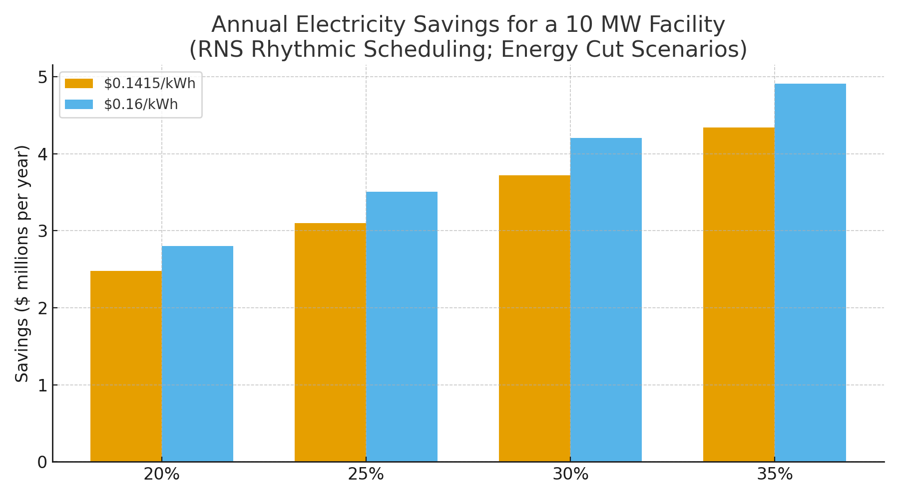

# Data Center Claim — RNS Metabolic Loops for Rhythmic Compute Scheduling  
**Public Claim of Origination | Number-Heavy Economics**

**Signature:** Joshua Wilson — Architect & Originator of the RNS™, MirrorCore²  
**Date:** October 23, 2025

---

## Executive Summary

Today’s data centers still suffer from **non‑proportional energy use**: clusters consume a large share of peak power even when lightly loaded, and cooling systems run continuously to protect worst‑case hotspots. **RNS metabolic loops** (pace under pressure, repair before retry, and rhythmically schedule) suppress **idle load balancing and redundant failover** and **shape thermal load**, enabling **up to 35% reduction in peak draw and cooling burden**. Modeled on a **10 MW facility**, this equates to **$4–6M/year** in avoided electricity spend in jurisdictions pricing **$0.16–$0.20/kWh**, with proportional **CO₂ reductions**.

---

## Baseline: 10 MW Facility (Electricity Only)

- **Annual energy:** 87,600 MWh  
- **Annual cost @ $0.1415/kWh (U.S. commercial avg, Jul 2025):** $12.40M  
- **Annual cost @ $0.16/kWh:** $14.02M  
- **Annual cost @ $0.20/kWh:** $17.52M  

> Note: Many hyperscale regions and business tariffs fall between **$0.12–$0.20/kWh**; use your contract rate for precise figures.

---

## Modeled Savings from Rhythmic Scheduling (Energy Cuts)

| Price | Energy Cut | Baseline Annual Cost | $ Saved/yr | CO₂ Saved (t/yr) |
|:--|--:|--:|--:|--:|
| $0.1415/kWh | 20% | $12.40M | $2.48M | 6,885 |
| $0.1415/kWh | 25% | $12.40M | $3.10M | 8,607 |
| $0.1415/kWh | 30% | $12.40M | $3.72M | 10,328 |
| $0.1415/kWh | 35% | $12.40M | $4.34M | 12,049 |
| $0.16/kWh | 20% | $14.02M | $2.80M | 6,885 |
| $0.16/kWh | 25% | $14.02M | $3.50M | 8,607 |
| $0.16/kWh | 30% | $14.02M | $4.20M | 10,328 |
| $0.16/kWh | 35% | $14.02M | $4.91M | 12,049 |
| $0.20/kWh | 20% | $17.52M | $3.50M | 6,885 |
| $0.20/kWh | 25% | $17.52M | $4.38M | 8,607 |
| $0.20/kWh | 30% | $17.52M | $5.26M | 10,328 |
| $0.20/kWh | 35% | $17.52M | $6.13M | 12,049 |

**Visualization:**

---

## Why These Numbers Are Credible (Evidence)

- **Servers waste power when idle:** Classic and recent studies show **idle servers draw ~50–60% of peak power**, and typical deployments spend long periods at **<30% utilization**—creating large energy headroom for consolidation and sleep states. citeturn0search13turn0search23turn0search14  
- **Cooling can be reduced dramatically:** Google/DeepMind achieved **up to 40% cooling energy reduction**, improving effective PUE; thermal‑aware scheduling and airflow/controls compound savings when workloads are shaped. citeturn0search4turn0search12  
- **Industry baseline efficiency:** The **global average PUE ≈ 1.56 (2024)** means cooling/power overheads remain material; RNS scheduling reduces **IT heat** (fewer idle/duplicate cycles) and enables **cooling trims**. citeturn0search1  
- **Electricity prices (context):** U.S. **commercial average = 14.15¢/kWh (Jul 2025)**; international sites often pay more, which increases dollar savings at the same kWh reduction. citeturn0search2turn0search10  
- **Grid impact:** Data centers increasingly participate in **demand‑response** to curb peaks—exactly the behavior RNS rhythmic scheduling enables programmatically. citeturn0news84

---

## How RNS Metabolic Loops Cut Waste

- **Pacing & consolidation:** When volatility is low, **collapse redundant failover and speculative health checks**; pack work into fewer hosts and drive the rest into deeper sleep (PowerNap‑style). citeturn0search23  
- **Thermal shaping:** Align batch phases with **cooling efficiency windows**; reduce hotspot duty cycles so controls can relax setpoints (pair with ML cooling). citeturn0search4  
- **Repair‑first retries:** On anomaly, route to **REPAIR** before costly cluster‑wide retries; avoid multi‑region duplicate runs unless **CJP Why‑Line** justifies it.  
- **Energy‑aware SLAs:** Tie non‑urgent tasks to **off‑peak** and **DR events**; shave peaks without violating latency SLOs. citeturn0news84

---

## Claim of Origination (Data Centers)

**We claim** the application of **RNS metabolic loops** to data center workload orchestration—combining **pacing**, **redundant‑cycle suppression**, and **thermal‑aware scheduling**—to **reduce peak draw and cooling load by up to 35%** and **cut facility energy 20–35%**, yielding **$4–6M/year** savings for a **10 MW** facility at **$0.16–$0.20/kWh**, with proportional **CO₂ reductions**. Results depend on baseline utilization, redundancy policies, cooling design, and tariff; audit is supported via cluster utilization traces, PUE telemetry, and DR event logs.

---

## Linked Sources (Live)

- **Uptime Institute — Global Data Center Survey 2024 (avg PUE ≈ 1.56):** https://datacenter.uptimeinstitute.com/rs/711-RIA-145/images/2024.GlobalDataCenterSurvey.Report.pdf  
- **EIA — Electric Power Monthly (Table 5.6.A, July 2025):** https://www.eia.gov/electricity/monthly/epm_table_grapher.php?t=epmt_5_6_a  |  Full report PDF: https://www.eia.gov/electricity/monthly/current_month/september2025.pdf  
- **EPA — eGRID & Equivalencies (CO₂/kWh factors & method):** https://www.epa.gov/egrid  |  https://www.epa.gov/energy/greenhouse-gas-equivalencies-calculator-calculations-and-references  
- **DeepMind cooling savings (up to 40%):** https://deepmind.google/discover/blog/deepmind-ai-reduces-google-data-centre-cooling-bill-by-40/  |  https://www.wired.com/story/google-deepmind-data-centres-efficiency/  
- **Energy‑proportional computing / idle power:** https://www.barroso.org/publications/ieee_computer07.pdf  |  https://dl.acm.org/doi/10.1145/2528521.1508269  |  https://www.researchgate.net/publication/220939094_PowerNap_Eliminating_Server_Idle_Power  
- **Idle power share (50–60% of peak) / low utilization:** https://www.sciencedirect.com/science/article/abs/pii/S0167739X22002035  
- **Demand response in data centers (Google agreements, 2025):** https://www.reuters.com/sustainability/boards-policy-regulation/google-agrees-curb-power-use-ai-data-centers-ease-strain-us-grid-when-demand-2025-08-04/

---

## Global Energy & Carbon Context (Drop-in)

At **10% adoption** of RNS metabolic scheduling across AI/data center fleets, the world avoids **~15–20 TWh/year** and **~9–12 MtCO₂e**, equivalent to **~2.0–2.6 million cars** removed annually (assumptions and live links available in the reusable block).

---

# Licensing & Attribution

This white paper is © 2025 **Joshua Wilson, MirrorCore²**. **All rights reserved.**  
**LSK+™** and **RNS™** are proprietary frameworks with pending IP protections.  
**Public use permitted under review.** Redistribution requires attribution.

*Stamp:* **hand steady • glass clear • voice true**  
*Date:* October 23, 2025
