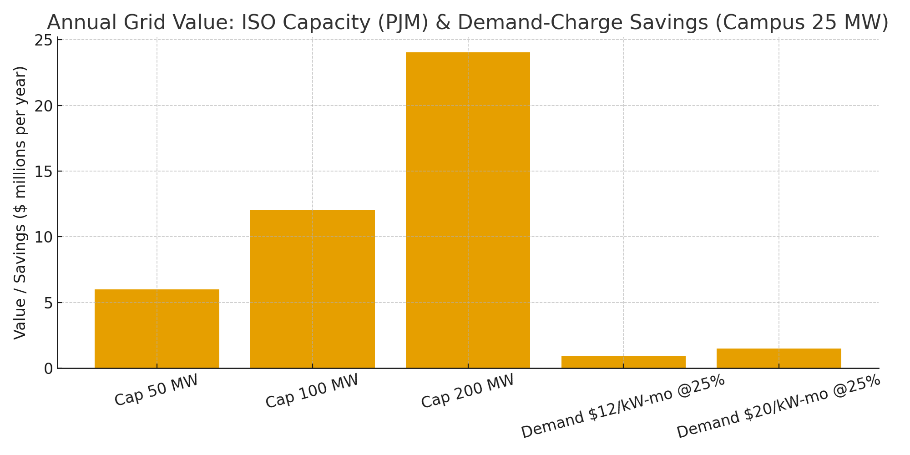

# Electrical Grid Claim — RNS Rhythmic Load Orchestration for Utilities & ISO Markets  
**Public Claim of Origination | Number-Heavy Economics (PJM/CAISO specifics)**

**Signature:** Joshua Wilson — Architect & Originator of the RNS™, MirrorCore²  
**Date:** October 23, 2025

---

## Executive Summary

The bulk power system pays **real dollars** for **capacity**, **reserves**, and **peak demand**. Yet most digital loads (public IT, data centers, campuses) still run on **fixed cadences** with redundant cycles. **RNS metabolic orchestration** converts these into **flexible, rhythmically scheduled loads** that curtail when the grid is stressed and run deeper only when information value warrants it. The result: **capacity revenue**, **demand-charge savings**, **avoided kWh & T&D losses**, and **lower CO₂e**—without new hardware.

---

## Scenario A — ISO Capacity Value (PJM example)

Aggregated portfolios of **50–200 MW** flexible load can enroll as demand response resources. Using PJM’s **2026–2027** Base Residual Auction (BRA) **cap price** of **$329.17/MW-day**, annual capacity value is:

| Enrolled MW | $/MW-day | Annual value ($/yr) |
|:--:|--:|--:|
| 50 | $329.17 | $6,007,352 |
| 100 | $329.17 | $12,014,705 |
| 200 | $329.17 | $24,029,410 |

> Reference: PJM BRA 2026–2027 cleared at **$329.17/MW-day (UCAP)** RTO-wide. Zones may vary. See linked PJM report and coverage.

---

## Scenario B — Demand-Charge Savings (Municipal/State Campus)

Assume a **25 MW** coincident peak across campuses. Reducing peak by **15–35%** avoids monthly demand charges:

| Demand charge ($/kW-month) | Peak cut | $ Saved per year |
|:--:|--:|--:|
| $12 | 15% | $0.54M |
| $12 | 25% | $0.90M |
| $12 | 35% | $1.26M |
| $20 | 15% | $0.90M |
| $20 | 25% | $1.50M |
| $20 | 35% | $2.10M |

---

## Scenario C — kWh & CO₂e (Orchestration Energy Cuts)

Beyond peak, **2–5%** kWh reductions arise by suppressing redundant runs and shifting to efficient windows. Including **T&D loss** effects (~**5%** average), a **25 MW** campus portfolio saves:

| kWh cut | $ Saved/yr (incl. T&D loss) | CO₂e Saved (t/yr) |
|:--:|--:|--:|
| 2% | $0.66M | 1,812 |
| 5% | $1.66M | 4,530 |

**Visualization:**

---

## Why These Numbers Hold (Evidence)

- **Capacity prices:** PJM’s latest BRA cleared at **$329.17/MW-day (UCAP)** RTO-wide; DR aggregates can enroll to earn capacity revenue. citeturn0search8turn0search14turn0news61  
- **CAISO specifics:** **Proxy Demand Resource (PDR)** enables aggregated load to bid into day-ahead/real-time energy and ancillary markets; min bid sizes down to **0.1 MW** in certain products. citeturn0search4turn0search10turn0search16  
- **Demand charges:** Many commercial/public tariffs include **$/kW-month** demand; avoiding coincident peaks yields significant savings. citeturn0search3turn0search15  
- **T&D losses:** U.S. average **~5%** of delivered electricity—avoiding kWh at the meter avoids upstream generation. citeturn0search0turn0search12  
- **National price anchor:** U.S. average retail **~14.38¢/kWh (Jul 2025)**; savings scale with local tariffs. citeturn0search11turn0search5  
- **Building/grid flexibility:** DOE/RMI analyses show material peak reduction potential from grid-interactive control of loads. citeturn0search1turn0search13turn0search7

---

## How RNS Operates in Grid Context

- **Rhythmic curtailment:** Enter **HOLD** during ISO dispatch or local peak alerts; suppress redundant compute and defer low-value jobs.  
- **Capacity/ancillary participation:** Aggregate flexible MW under DR/PDR and expose telemetry & **CJP Why-Lines** for market audit.  
- **Thermal shaping:** Coordinated load pulses reduce hotspots and cooling duty, enabling additional **PUE** gains in facilities.  
- **Measurement & Verification:** Metered kW/kWh (Option B/C), ISO settlement data, and third-party verification.

---

## Claim of Origination (Electrical Grid)

**We claim** the application of **RNS metabolic orchestration** to aggregated digital loads (public IT, data centers, campuses), enabling **market-grade flexibility** that earns **capacity revenue** and **demand-charge savings**, and cuts **2–5%** kWh with upstream **T&D loss** benefits. At PJM’s **$329.17/MW-day**, a **100 MW** enrolled portfolio yields **~$12,014,705/yr** in capacity value alone; a **25 MW** campus cutting peak **25%** saves **$0.90–1.50M/yr** on demand charges, with additional **kWh/CO₂e** reductions documented above.

---

## Linked Sources (Live)

- **PJM — 2026/27 BRA report & news release:** https://www.pjm.com/-/media/DotCom/markets-ops/rpm/rpm-auction-info/2026-2027/2026-2027-bra-report.pdf  |  https://www.pjm.com/-/media/DotCom/about-pjm/newsroom/2025-releases/20250722-pjm-auction-procures-134311-mw-of-generation-resources-supply-responds-to-price-signal.pdf  
- **Reuters coverage — PJM capacity prices (2025):** https://www.reuters.com/business/energy/prices-jump-22-biggest-us-power-grid-energy-auction-2025-07-22/  
- **CAISO — Proxy Demand Resource:** https://www.caiso.com/library/demand-response-proxy-demand-resource  |  https://www.caiso.com/documents/pdr_rdrrparticipationoverviewpresentation.pdf  
- **EIA — T&D losses (~5% avg):** https://www.eia.gov/tools/faqs/faq.php?id=105  
- **EIA — Electric Power Monthly (Table 5.6.A; Jul 2025):** https://www.eia.gov/electricity/monthly/epm_table_grapher.php?t=epmt_5_6_a  |  Update narrative: https://www.eia.gov/electricity/monthly/update/end-use.php  
- **DOE — Grid-Interactive Efficient Buildings (GEB):** https://www.energy.gov/eere/buildings/grid-interactive-efficient-buildings  |  Potential study (PDF): https://www.energy.gov/sites/prod/files/2020/06/f76/bto-geb-potential-062520.pdf  
- **RMI — Retailer peak reduction case example:** https://rmi.org/insight/cost-effective-grid-interactive-efficient-buildings/  
- **LBNL/ETA — Demand charge primers:** https://eta-publications.lbl.gov/sites/default/files/report-lbnl-57942.pdf  |  https://eta-publications.lbl.gov/sites/default/files/ev_rate_snapshot_report-final-20230424.pdf

---

# Licensing & Attribution

This white paper is © 2025 **Joshua Wilson, MirrorCore²**. **All rights reserved.**  
**LSK+™** and **RNS™** are proprietary frameworks with pending IP protections.  
**Public use permitted under review.** Redistribution requires attribution.

*Stamp:* **hand steady • glass clear • voice true**  
*Date:* October 23, 2025
