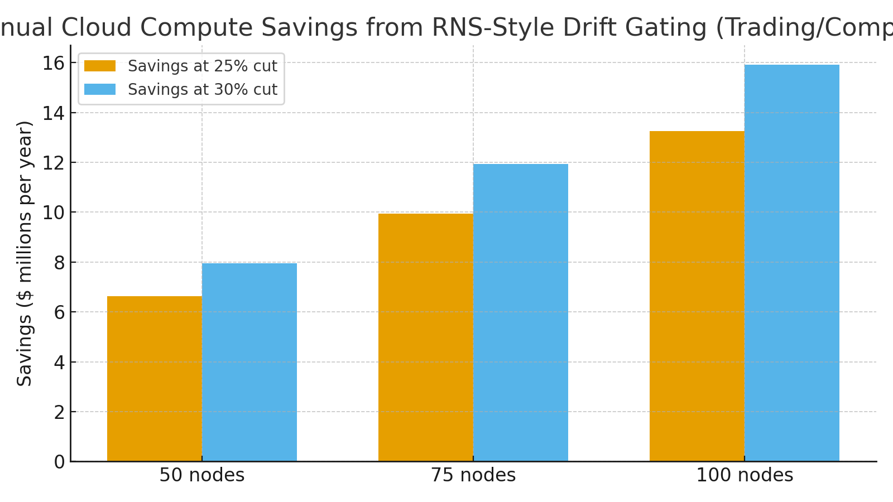

# Financial Systems Claim — RNS Immune Design for Trading & Compliance  
**Public Claim of Origination | Number-Heavy Economics**

**Signature:** Joshua Wilson — Architect & Originator of the RNS™, MirrorCore²  
**Date:** October 23, 2025

---

## Executive Summary

Trading, risk, and compliance stacks **re-simulate** incessantly: parameter sweeps, intraday scenario sets, and nightly surveillance backfills. The **RNS immune design** detects **data drift early** and **gates redundant runs**—preventing wasted GPU hours. Modeled against common 8×H100 cloud nodes, cutting redundant simulations **25–30%** yields **$7.9–15.9M/year** in compute savings for 50–100 node fleets, with material **carbon reductions** for on‑prem operations. Benchmarks like **STAC‑A2** and **STAC‑A3** quantify the scale of financial simulation loads on modern GPUs, while cloud price sheets bound the economics.

---

## Baseline Compute Economics (Cloud)

We model on-demand fleets using a representative **$~60.5 per node‑hour** for an **8×H100** instance (midpoint of published roundups). For completeness, note that providers publish **per‑GPU** and **per‑node** rates and offer **capacity blocks/commitments** that can be materially lower in certain regions.

- **AWS P5 (8×H100) on-demand ranges** summarized by industry trackers (≈ **$55–66/node‑hour**, ≈ **$6.8–8.25/GPU‑hr**).  
- **GCP A3 (8×H100)**: region‑dependent, **~$88–127/node‑hour** list.  
- **Azure ND H100 v5**: published on-demand around **$98/node‑hour** in trackers.  
- **AWS Capacity Blocks (illustrative)**: effective rates published per instance and per GPU for block purchases.

**Assumptions used below**: $60.54/node‑hour (8×H100), 24×365 operation, no spot/commit discounts.

---

## Modeled Savings from Drift Gating

RNS detects **distribution shift** and **halts/suppresses** expensive re‑sims when the expected information gain is low—before launching full GPU jobs.

**Annual savings with RNS-style gating:**

| Fleet (8×H100 nodes) | Baseline Annual Compute ($) | Savings @ 25% | Savings @ 30% |
|:--:|--:|--:|--:|
| 50 | $26.52M | $6.63M | $7.95M |
| 75 | $39.77M | $9.94M | $11.93M |
| 100 | $53.03M | $13.26M | $15.91M |

**Visualization:**

> These savings reflect **compute-hours avoided**, not performance tuning. They stack with efficiency work (kernel/precision/pathwise cuts).

---

## Why This Holds in Finance (Evidence & Benchmarks)

- **Backtesting throughput (STAC‑A3):** GPU systems achieve **tens to hundreds of millions of simulations/hour**, demonstrating the enormous re‑sim potential in quant research.  
- **Derivatives risk (STAC‑A2):** H100 systems set new records, including **hundreds of millions of paths in 10 minutes** and published **energy efficiency** (e.g., **~365k options/kWh** in one report), underscoring the energy stakes of uncontrolled re‑sims.  
- **Drift → retraining/re‑simulation cost:** Research on **cost‑aware retraining** shows event‑driven updates, not fixed schedules, minimize waste under drift; RNS generalizes this by **gating simulation workloads** when drift signals are low.

---

## On‑Prem Reference: Energy & Carbon Math

Per **8×H100** node (conservative: GPU draw only, host excluded; **PUE = 1.56** applied):

- **IT power:** 5.6 kW (8 × 700 W) → **Facility power:** 8.736 kW  
- **Annual energy:** 76,527 kWh (**~76.5 MWh**)  
- **Annual CO₂ (U.S. avg 0.393 kg/kWh):** ~30.1 tCO₂ per node

**Fleet impact (examples):**

- **50 nodes:** ~1,504 tCO₂/yr baseline → **−25–30%** saves **~376–451 tCO₂/yr**.  
- **100 nodes:** ~3,008 tCO₂/yr baseline → **−25–30%** saves **~752–902 tCO₂/yr**.

> Using **U.S. national average** emissions factor; substitute **eGRID subregion** for location‑based accounting.

---

## RNS Mechanisms for Finance

- **DriftLock (DL_meta):** Detects **data/model drift** and routes to **REPAIR/HOLD** before launching full re‑sims.  
- **Metabolic Pacing (LMC+):** Scales job depth/batch/paths with **energy budget and overload Ω**, capping low‑value runs.  
- **Why‑Lines (LSK+ / CJP):** Every expensive decision (e.g., **re‑simulate?**) emits a **human‑readable justification** referencing drift signals and expected gain.

---

## Claim of Origination (Financial Systems)

**We claim** the application of the **RNS immune design** to trading, risk, and compliance computation, wherein **data‑drift signals** **gate and suppress redundant simulations** and **route to repair** before confident re‑runs proceed, yielding **25–30%** cuts in GPU compute hours under typical drift regimes. Under common cloud rates (≈ **$60.54/node‑hour** for **8×H100**), fleets of **50–100 nodes** realize **~$8.0–15.9M/year** in avoided spend; on‑prem fleets realize proportional **kWh and CO₂** reductions per the energy model above.

---

## Linked Sources (Live)

- **AWS EC2 — Capacity Blocks pricing (H100 p5.48xlarge, effective per‑instance & per‑GPU rates):** https://aws.amazon.com/ec2/capacityblocks/pricing/  
- **Azure ND H100 v5 series (overview & sizes):** https://learn.microsoft.com/en-us/azure/virtual-machines/sizes/gpu-accelerated/ndh100v5-series  
- **GCP A3 (8×H100) pricing overview:** https://gcloud-compute.com/a3-highgpu-8g.html  
- **Roundup of H100 on‑demand pricing (per node & per GPU):** https://www.thundercompute.com/blog/aws-p5-vs-thunder-compute  
- **STAC‑A3 backtesting (NVIDIA infographic):** https://www.nvidia.com/content/dam/en-zz/Solutions/industries/finance/987205_STAC_Benchmark_Infographic_v06.pdf  
- **STAC‑A2 derivatives risk on H100 (NVIDIA dev blog):** https://developer.nvidia.com/blog/nvidia-h100-system-sets-records-for-hpc-and-generative-ai-financial-risk-calculations/  
- **STAC‑A2 report highlights (energy efficiency, options/kWh):** https://docs.stacresearch.com/news/NVDA231030  
- **EIA — Electric Power Monthly (Table 5.6.A, July 2025 prices):** https://www.eia.gov/electricity/monthly/epm_table_grapher.php?t=epmt_5_6_a  
- **EIA — Full report PDF (Sept 2025):** https://www.eia.gov/electricity/monthly/current_month/september2025.pdf  
- **Uptime Institute — Global Data Center Survey 2024 (average PUE 1.56):** https://datacenter.uptimeinstitute.com/rs/711-RIA-145/images/2024.GlobalDataCenterSurvey.Report.pdf  
- **EPA — eGRID & Equivalencies (CO₂/kWh factors & method):** https://www.epa.gov/egrid  |  https://www.epa.gov/energy/greenhouse-gas-equivalencies-calculator-calculations-and-references  
- **Cost‑aware retraining under drift (Knowledge‑Based Systems, 2024):** https://www.sciencedirect.com/science/article/pii/S0950705124002454

---

**Public Claim of Origination:** This document is hereby submitted as a public, time‑stamped claim for RNS immune‑style drift gating in financial systems, including quantified savings models and linked evidence.
