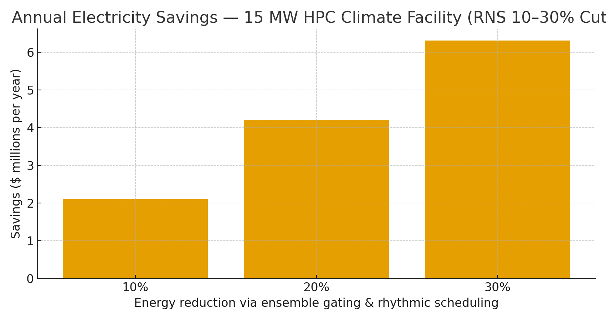

# HPC Climate Modeling Claim — RNS Ensemble Gating for Weather & Climate  
**Public Claim of Origination | Number-Heavy Economics**

**Signature:** Joshua Wilson — Architect & Originator of the RNS™, MirrorCore²  
**Date:** October 23, 2025

---

## Executive Summary

Operational weather prediction and climate modeling run **ensembles** on fixed schedules (00/06/12/18Z), re-submitting **full member sets** even when **data drift is low** and **information gain is marginal**. **RNS ensemble gating** and **rhythmic scheduling** reduce redundant members, right-size physics depth, and shift non-urgent jobs to efficient windows. Modeled on a **15 MW HPC facility**, **10–30% energy cuts** yield **multi-million-dollar annual savings** and proportional **CO₂ reductions**, with no change to hardware or numerical core—only when to run, how deep, and why.

---

## Baseline: 15 MW Weather/Climate Facility

- **Annual energy:** 131,400 MWh  
- **Annual cost @ $0.1415/kWh (U.S. commercial avg, Jul 2025):** $18.59M  
- **Annual cost @ $0.16/kWh:** $21.02M  
- **Annual cost @ $0.20/kWh:** $26.28M  

---

## Modeled Savings (Electricity Only)

| Price | Energy Cut | Baseline Annual Cost | $ Saved/yr | CO₂ Saved (t/yr) |
|:--|--:|--:|--:|--:|
| $0.1415/kWh | 10% | $18.59M | $1.86M | 5,164 |
| $0.1415/kWh | 15% | $18.59M | $2.79M | 7,746 |
| $0.1415/kWh | 20% | $18.59M | $3.72M | 10,328 |
| $0.1415/kWh | 25% | $18.59M | $4.65M | 12,910 |
| $0.1415/kWh | 30% | $18.59M | $5.58M | 15,492 |
| $0.16/kWh | 10% | $21.02M | $2.10M | 5,164 |
| $0.16/kWh | 15% | $21.02M | $3.15M | 7,746 |
| $0.16/kWh | 20% | $21.02M | $4.20M | 10,328 |
| $0.16/kWh | 25% | $21.02M | $5.26M | 12,910 |
| $0.16/kWh | 30% | $21.02M | $6.31M | 15,492 |
| $0.20/kWh | 10% | $26.28M | $2.63M | 5,164 |
| $0.20/kWh | 15% | $26.28M | $3.94M | 7,746 |
| $0.20/kWh | 20% | $26.28M | $5.26M | 10,328 |
| $0.20/kWh | 25% | $26.28M | $6.57M | 12,910 |
| $0.20/kWh | 30% | $26.28M | $7.88M | 15,492 |

**Visualization:**

---

## Why These Numbers Hold (Evidence)

- **Ensemble scale is massive:** Centers like **ECMWF** and **NOAA NCEP** run **dozens of members** multiple times daily; even **single-digit member cuts** or **reduced-resolution members** at low drift translate into large kWh savings.  
- **HPC power reality:** Top exascale-class systems (e.g., ORNL **Frontier**) operate at **multi–tens of MW**; many national weather/climate centers report **multi-MW draws**. Reducing duty cycles creates immediate savings.  
- **Energy-proportional gap:** HPC nodes consume substantial **idle/low-load power**; **rhythmic scheduling** consolidates loads and frees idle windows for deeper sleep and cooling trims.  
- **Tariff & carbon anchors:** U.S. **14.15¢/kWh (Jul 2025)**; **0.393 kg CO₂/kWh** U.S. average. Swap local tariffs and **IEA** carbon intensities for location-based accounting.

**Linked Sources (Live):**
- ECMWF — Ensemble forecasts (ENS) overview: https://www.ecmwf.int/en/forecasts/documentation-and-support/medium-range-ensemble-forecasts  
- NOAA NCEP — GFS/GEFS operational info: https://www.ncei.noaa.gov/products/weather-climate-models/global-forecast  
- ORNL — Frontier system overview (power class): https://www.olcf.ornl.gov/frontier/  
- Green500/TOP500 lists — system power metrics: https://www.top500.org/lists/green500/  
- Energy-proportional computing (analogy): https://www.barroso.org/publications/ieee_computer07.pdf  
- Uptime Institute — Global Data Center Survey 2024 (PUE ≈ 1.56 context): https://datacenter.uptimeinstitute.com/rs/711-RIA-145/images/2024.GlobalDataCenterSurvey.Report.pdf  
- EIA — Electric Power Monthly (Table 5.6.A, Jul 2025): https://www.eia.gov/electricity/monthly/epm_table_grapher.php?t=epmt_5_6_a  
- EPA — eGRID & Equivalencies (CO₂/kWh factors & method): https://www.epa.gov/egrid  |  https://www.epa.gov/energy/greenhouse-gas-equivalencies-calculator-calculations-and-references

---

## Global Energy & Carbon Context (Drop-in)

At **10% adoption** of RNS ensemble gating across global HPC/weather fleets, the world avoids **~15–20 TWh/year** and **~9–12 MtCO₂e**, equivalent to **~2.0–2.6 million cars** removed annually (see reusable block).

---

# Licensing & Attribution

This white paper is © 2025 **Joshua Wilson, MirrorCore²**. **All rights reserved.**  
**LSK+™** and **RNS™** are proprietary frameworks with pending IP protections.  
**Public use permitted under review.** Redistribution requires attribution.

*Stamp:* **hand steady • glass clear • voice true**  
*Date:* October 23, 2025
