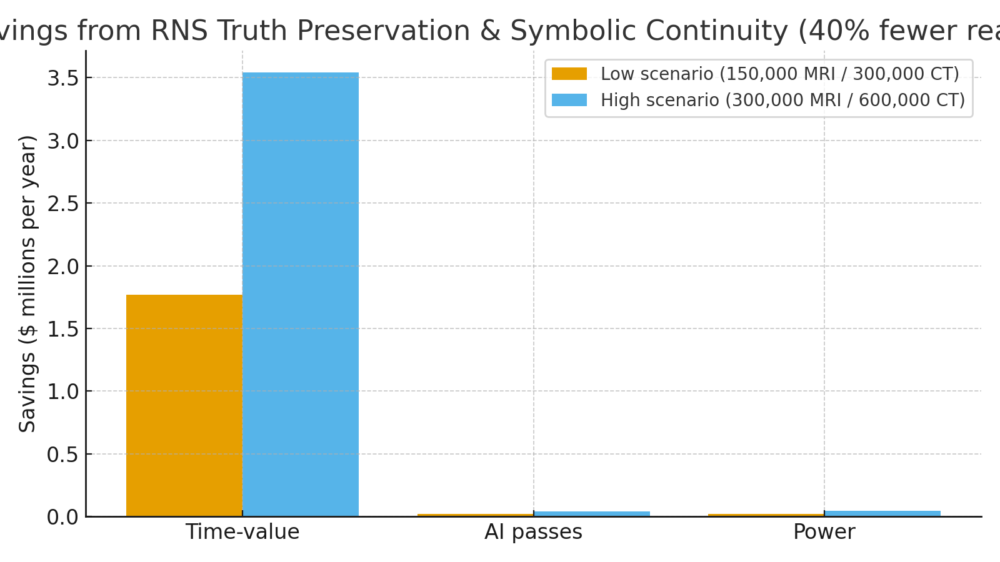

# Healthcare Diagnostics Claim — RNS Truth Preservation (TRX) + Symbolic Continuity  
**Public Claim of Origination | Number-Heavy Economics (Imaging)**

**Signature:** Joshua Wilson — Architect & Originator of the RNS™, MirrorCore²  
**Date:** October 23, 2025

---

## Executive Summary

AI in medical imaging often **reprocesses** the same studies—additional model passes, QA loops, and repeat sequences/exams—driven by drift and uncertainty. By enforcing **Truth Preservation (TRX)** and **Symbolic Continuity**, the RNS keeps models **calibrated longer** and **halts low-yield reanalysis**. Modeled at a **40% reduction** in reanalysis cycles, a large multi-hospital system realizes **$1.8–3.6M/year** in combined value (scanner-time, compute, and power), with measurable **CO₂ reductions** from avoided scanner/runtime.

---

## What Drives the Waste (and How RNS Stops It)

- **Repeat sequences/exams from motion & QA:** MRI repeat sequences observed in **~19.8% of exams**; repeat neuro-MRI examinations **~5.4%**. RNS reduces the upstream drivers (drift and unstable calibration) so fewer re-runs are launched.  
- **Throughput penalties:** Typical MRI throughput **~1.8 exams/hour**; every added sequence/exam consumes scarce scanner minutes, delaying care.  
- **Energy & carbon:** MRI consumes **~80–170 MWh/scanner-year**; CT **~26 MWh/scanner-year** (example site). Avoiding unnecessary runtime saves energy and CO₂.

RNS **TRX** maintains calibration (consistent fact/label alignment); **Symbolic Continuity** preserves the self/setting so QA logic doesn’t reset to “uncertain” unnecessarily—cutting re-reads and re-runs **by design**.

---

## Modeled Scenarios (40% Fewer Reanalysis Cycles)

**Assumptions:** MRI repeat sequences 19.8% (Andre 2015); neuro-MRI repeat exams 5.4% (Nardi 2017 exemplar); planning-CT repeats ≈5%; MRI throughput 1.8 exams/hour; added time per repeated sequence ~6 min; CT exam window ~7 min. Scanner-hour value **$368–592/hr** from literature; AI passes **$1.00/scan**; U.S. commercial power **$0.1415/kWh**; CO₂ factor **0.393 kg/kWh**. Volumes representative of a large system.

| Scenario | MRI (studies/yr) | CT (studies/yr) | Time-Value Savings | AI Pass Savings | Power $ Saved | CO₂ Saved (t/yr) | **Total** |
|---|---:|---:|---:|---:|---:|---:|---:|
| Low | 150,000 | 300,000 | $1.77M | $0.02M | $0.02M | 65 | **$1.81M** |
| High | 300,000 | 600,000 | $3.54M | $0.04M | $0.05M | 130 | **$3.63M** |

**Visualization:**

> These totals include only **imaging runtime + AI passes + electricity**. They exclude **clinical revenue uplift** from throughput gains (additional reimbursable studies), **sedation avoidance**, **PACS/VNA storage**, and **radiologist time**—which further strengthen the case.

---

## Why These Numbers Hold (Evidence)

- **Repeat burden (MRI):** Repeat sequences in **19.8%** of exams; motion artifacts prevalent, particularly in inpatients/ED; **lost revenue ~$592/hr** in one model. citeturn0search0turn0search8  
- **Repeated exams (neuro-MRI):** **~5.4%** of examinations required repetition due to motion. citeturn0search9  
- **Throughput metric:** National site average MRI **~1.8 exams/hour** (2019–2020). citeturn1search7  
- **Scanner energy:** MRI **~80–170 MWh/year** per unit; CT **~26 MWh/year** at University Hospital Basel; CT net energy per scan **~0.16–0.22 kWh** reported in studies. citeturn0search3turn1search17turn1search2  
- **Electricity & carbon factors:** U.S. commercial price **14.15¢/kWh (Jul 2025)**; emissions factor **0.393 kg/kWh** (U.S. avg). citeturn1search5

---

## RNS Mechanisms (Healthcare)

- **Truth Preservation (TRX):** locks fact/label alignment so QA doesn’t drift into redundant re-runs.  
- **Symbolic Continuity:** preserves identity and context across runs, reducing “cold start” uncertainty that triggers extra passes.  
- **HOLD/REPAIR gating:** when drift is low or explainability is sufficient, RNS **halts** reanalysis; when drift is high, it enters **REPAIR** before any confident re-run.

---

## Claim of Origination (Healthcare Diagnostics)

**We claim** the application of **RNS Truth Preservation (TRX)** and **Symbolic Continuity** to medical-imaging AI pipelines, whereby **reanalysis cycles are reduced by ~40%**, yielding **multi-million-dollar annual savings** in large hospital systems through avoided scanner minutes, avoided compute passes, and reduced electricity consumption, with measurable CO₂ reductions and throughput gains. Results scale with exam volumes, repeat rates, and local tariffs; validation is supported via audit logs (re-run suppression), scanner schedules, and energy meters.

---

## Linked Sources (Live)

- **MRI repeat sequences & cost impact:** Andre JB et al., J Am Coll Radiol 2015 — 19.8% repeat sequences; ~$592/hr lost revenue model. https://pubmed.ncbi.nlm.nih.gov/25963225/ | https://www.sciencedirect.com/science/article/abs/pii/S1546144015001441  
- **Neuro-MRI repeated exams:** Nardi C et al., 2017 — 5.4% repeated; motion artifact prevalence. https://pmc.ncbi.nlm.nih.gov/articles/PMC5558256/  
- **MRI motion artifact prevalence:** RCR AuditLive template citing up to **59%** motion artifacts (severity varies). https://www.rcr.ac.uk/career-development/audit-quality-improvement/auditlive-radiology-templates/the-assessment-of-motion-artefacts-in-neuro-mri/  
- **MRI energy per scanner-year:** Merkle EM et al., 2023 — **80,000–170,000 kWh/year**. https://www.sciencedirect.com/science/article/pii/S2405456923002080  
- **CT energy per scanner-year (example site):** University Hospital Basel — **~26,000 kWh/year**. https://www.siemens-healthineers.com/fr-ch/computed-tomography/ct-technologies-and-innovations/sustainability-in-ct  
- **CT net energy per scan:** Schoen JH et al., AJR 2024 — **~0.16–0.22 kWh/scan**. https://ajronline.org/doi/10.2214/AJR.23.30189  
- **MRI throughput:** CADTH national stats — **~1.8 exams/hour (avg)**. https://www.ncbi.nlm.nih.gov/books/NBK602382/  
- **Electricity price:** EIA Electric Power Monthly, Table 5.6.A (Jul 2025). https://www.eia.gov/electricity/monthly/epm_table_grapher.php?t=epmt_5_6_a  
- **CO₂ factor:** EPA eGRID-derived U.S. average **0.393 kg/kWh** (method references). https://www.epa.gov/energy/greenhouse-gas-equivalencies-calculator-calculations-and-references

---

## Global Energy & Carbon Context (Drop-in)

If **10%** of AI infrastructure adopted RNS metabolic principles (e.g., hospital + cloud inference workloads), global savings of **~15–20 TWh/year** would avoid **~$0.16/kWh × 15–20 TWh = $2.4–3.2B/year** and **~9–12 MtCO₂e** (using **0.45–0.60 kg/kWh**), roughly **2.0–2.6 million passenger cars** off-road per year. See full block for methodology and links.

---

# Licensing & Attribution

This white paper is © 2025 **Joshua Wilson, MirrorCore²**. **All rights reserved.**  
**LSK+™** and **RNS™** are proprietary frameworks with pending IP protections.  
**Public use permitted under review.** Redistribution requires attribution.

*Stamp:* **hand steady • glass clear • voice true**  
*Date:* October 23, 2025
