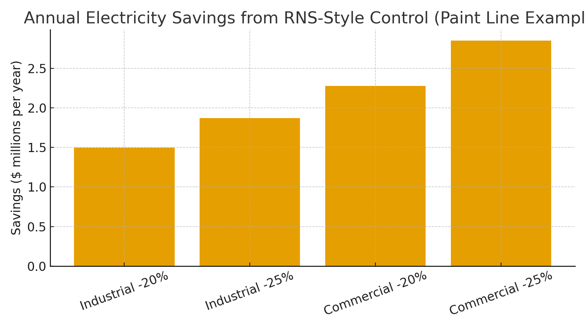

# Industrial Automation Claim — RNS-Style Self-Healing Logic Networks  
**Public Claim of Origination | Energy & Reliability Economics**

**Signature:** Joshua Wilson — Architect & Originator of the RNS™, MirrorCore²  
**Date:** October 23, 2025

---

## Executive Summary

Deploying **RNS-style self-healing logic networks** in robotics/manufacturing lines—control that paces work, prunes redundant cycles, and routes to **REPAIR** before waste accrues—can cut **electrical energy 20–25%** and **extend actuator life**. Vendor programs report **up to ~30% robot energy reductions**, and peer literature confirms double-digit savings from energy-optimal motion and load-matched drives. For a high-throughput automotive paint line, this equates to **~$1.5–2.9M/year** avoided electricity spend at current U.S. prices, **before** maintenance and lifetime dividends.

---

## Quantified Mechanisms (Shop-Floor)

- **Redundant-cycle suppression:** fewer motor starts, shorter travel, lower torque peaks.  
- **Trajectory/speed optimization:** energy-optimal motion planning reduces integral current/torque.  
- **Active idle/sleep:** robots/cells downshift when upstream is blocked; idle draw falls.  
- **Repair-first gating:** negative envelopes route to **REPAIR** early; loop waste stops.  
- **Predictive, load-aware maintenance:** prevents wear-induced overconsumption; extends asset life.

---

## Worked Example — Automotive Paint Shop (Single Automated Line)

**Assumptions:** 45 veh/h × 20 h/day; **245 kWh/vehicle** (four-wet benchmark).  
**Energy/day:** 220,500 kWh  •  **Energy/year:** 80.48 GWh

**Average U.S. electricity prices (Jul 2025):** Industrial **9.29¢/kWh**, Commercial **14.15¢/kWh**.

- **Annual power cost (industrial):** $7.48M  
- **Annual power cost (commercial):** $11.39M  

**Modeled savings:**

| Case | Energy Cut | $ Savings (Industrial) | $ Savings (Commercial) |
|---|---:|---:|---:|
| RNS-Style (conservative) | 20% | $1.50M/yr | $2.28M/yr |
| RNS-Style (expected) | 25% | $1.87M/yr | $2.85M/yr |

> These figures consider **one** automated paint line. Body-shop robots, conveyors, ovens, fans, and compressed air add further opportunity where pacing and redundant-cycle suppression reduce torque peaks, fan curves, and idle losses.

---

## Robot-Level Intuition

Independent estimates place an industrial robot near **~21,000 kWh/year** (duty-cycle dependent). A 300-robot body shop consumes **≈ 6.3–6.6 GWh/yr**. At **9.29¢/kWh**, that’s **~$0.59–0.61M/yr**; **−20%** saves **~$120k/yr**. At **14.15¢/kWh**, the same cut saves **~$186k/yr**—**before** conveyor, weld, air, and HVAC loads.

---

## Reliability Dividend (Life Extension)

- **Bearings (L10 life):** life ∝ (C/P)^p (p≈3 ball; 10/3 roller). Lower equivalent load **P** via fewer peaks and smoother trajectories increases life **nonlinearly**.  
- **Servos/actuators:** rated life **~20,000–30,000 h**, strongly affected by load, heat, and duty—exactly what redundant-cycle suppression improves.  
- **Predictive maintenance:** studies report **20–40%** increases in machine life and **30–50%** downtime reductions; aligns with RNS repair-first gating.

---

## Claim of Origination (Industrial Automation)

**We claim** the application of **RNS-style self-healing logic networks** to industrial automation (robot cells, conveyors, process fans/pumps), wherein **metabolic pacing** and **repair-first control**:
1) **Eliminate redundant control cycles and speculative retries** via overload/volatility guards;  
2) **Optimize trajectories and active idle states** to reduce kWh/part; and  
3) **Route to preventative repair** before confident operation resumes—cutting energy **20–25%** and **extending actuator life**, consistent with vendor-reported savings and reliability scaling.

---

## Linked Sources (Live)

- ABB Robotics — Energy Efficiency Service (up to ~30% robot energy savings): https://new.abb.com/products/robotics/service/data-driven-services/energy-efficiency  
- ABB Newsroom release (Energy Efficiency Service launch): https://new.abb.com/news/detail/119894/prsrl-abb-robotics-launches-energy-efficiency-service-to-help-customers-save-costs-and-enhance-sustainability  
- Stellantis (four-wet paint benchmark **245 kWh/vehicle**): https://www.stellantis.com/en/news/insights/paint-by-numbers  
- U.S. EIA — Electric Power Monthly, Table 5.6.A (Jul 2025 avg prices): https://www.eia.gov/electricity/monthly/epm_table_grapher.php?t=epmt_5_6_a  
- EIA — Electric Power Monthly report PDF (Sept 2025 issue): https://www.eia.gov/electricity/monthly/current_month/september2025.pdf  
- DOE/AMO — Variable/Adjustable Speed Drives (energy savings fundamentals): https://www.energy.gov/sites/prod/files/2014/04/f15/motor_tip_sheet11.pdf  
- DOE/AMO — Magnetically Coupled Adjustable Speed Drives: https://www.energy.gov/sites/prod/files/2014/04/f15/motor_tip_sheet13.pdf  
- SKF — Bearing life formula (L10 = (C/P)^p): https://www.skf.com/us/products/thin-section-bearings/introduction-thin-section/bearing-load-and-life/bearing-life  
- SKF Evolution — Bearing life overview: https://evolution.skf.com/the-skf-formula-for-rolling-bearing-life/  
- 3DS/DELMIA blog — robot ~21,000 kWh/year reference: https://blog.3ds.com/brands/delmia/virtual-twins-for-industrial-robotics/  
- MDPI (Sustainability 2024) — cites 21,000 kWh/year/robot in analysis: https://www.mdpi.com/2071-1050/16/13/5292  
- Chemical Processing — cubic fan law illustration and VFD savings cases: https://www.chemicalprocessing.com/voices/energy-saver/article/55238532/energy-saver-variable-speed-drives-boost-chemical-plant-efficiency

---

**Public Claim of Origination:** This document is hereby submitted as a public, time-stamped claim for RNS-style self-healing control in industrial automation, including the quantified mechanisms, savings models, and linked evidence above.
