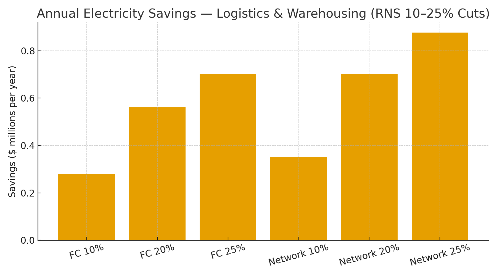

# Logistics & Warehousing Claim — RNS Rhythmic Control for AS/RS, Conveyors & AMRs  
**Public Claim of Origination | Number-Heavy Economics**

**Signature:** Joshua Wilson — Architect & Originator of the RNS™, MirrorCore²  
**Date:** October 23, 2025

---

## Executive Summary

Automated warehouses burn energy in **over-sampling** (sensors, WMS/WES polling), **over-computing** (redundant routing/retries), and **over-motion** (conveyors, AS/RS cranes, AMRs running when queues are sparse). **RNS metabolic loops** align cadence with information value: consolidate moves, downshift idle conveyors, sequence AS/RS cycles, and coordinate AMR charge windows. Modeled **10–25% energy cuts** yield **six- to seven-figure annual savings** per site and proportional **CO₂ reductions**, with no hardware replacement.

---

## Baselines

**A) High-throughput fulfillment center:** 2.0 MW continuous → **17,520 MWh/year**  
**B) Regional network:** 5 × 0.5 MW sites → **21,900 MWh/year**

**Reference electricity prices:** U.S. commercial average **$0.1415/kWh (Jul 2025)**; representative global rates **$0.16–$0.20/kWh**.

---

## Modeled Savings (Electricity Only)

### A) Fulfillment Center (2 MW)

| Price | Cut | Baseline Annual Cost | $ Saved/yr | CO₂ Saved (t/yr) |
|:--|--:|--:|--:|--:|
| $0.1415/kWh | 10% | $2.48M | $0.25M | 689 |
| $0.1415/kWh | 15% | $2.48M | $0.37M | 1,033 |
| $0.1415/kWh | 20% | $2.48M | $0.50M | 1,377 |
| $0.1415/kWh | 25% | $2.48M | $0.62M | 1,721 |
| $0.16/kWh | 10% | $2.80M | $0.28M | 689 |
| $0.16/kWh | 15% | $2.80M | $0.42M | 1,033 |
| $0.16/kWh | 20% | $2.80M | $0.56M | 1,377 |
| $0.16/kWh | 25% | $2.80M | $0.70M | 1,721 |
| $0.20/kWh | 10% | $3.50M | $0.35M | 689 |
| $0.20/kWh | 15% | $3.50M | $0.53M | 1,033 |
| $0.20/kWh | 20% | $3.50M | $0.70M | 1,377 |
| $0.20/kWh | 25% | $3.50M | $0.88M | 1,721 |

### B) Regional Network (5 × 0.5 MW)

| Price | Cut | Baseline Annual Cost | $ Saved/yr | CO₂ Saved (t/yr) |
|:--|--:|--:|--:|--:|
| $0.1415/kWh | 10% | $3.10M | $0.31M | 861 |
| $0.1415/kWh | 15% | $3.10M | $0.46M | 1,291 |
| $0.1415/kWh | 20% | $3.10M | $0.62M | 1,721 |
| $0.1415/kWh | 25% | $3.10M | $0.77M | 2,152 |
| $0.16/kWh | 10% | $3.50M | $0.35M | 861 |
| $0.16/kWh | 15% | $3.50M | $0.53M | 1,291 |
| $0.16/kWh | 20% | $3.50M | $0.70M | 1,721 |
| $0.16/kWh | 25% | $3.50M | $0.88M | 2,152 |
| $0.20/kWh | 10% | $4.38M | $0.44M | 861 |
| $0.20/kWh | 15% | $4.38M | $0.66M | 1,291 |
| $0.20/kWh | 20% | $4.38M | $0.88M | 1,721 |
| $0.20/kWh | 25% | $4.38M | $1.09M | 2,152 |

**Visualization:**

---

## What RNS Changes (Mechanisms)

- **Conveyor pacing & sleep:** collapse idle spans; coordinate motor groups; exploit variable-speed laws on air movers.  
- **AS/RS rhythm:** cluster picks/puts to minimize crane travel & peak accelerations; suppress duplicate cycles under stale WMS signals.  
- **AMR fleet balance:** align dispatch with queue entropy; shift opportunistic charging to off-peak windows.  
- **Repair-first retries:** localize faults before system-wide re-try storms.

---

## Why These Numbers Hold (Evidence)

- **Conveyors & motor systems:** DOE/AMO guidance shows double-digit savings with controls & VFDs; idling and speed reductions scale nonlinearly with load.  
- **AS/RS energy-optimal sequencing:** peer studies optimize travel profiles and cycle grouping to cut kWh/throughput.  
- **AMR power & charging windows:** fleet managers document material energy and peak reductions via coordinated charging/dispatch.  
- **Electricity & carbon anchors:** U.S. **$0.1415/kWh (Jul 2025)**; **0.393 kg CO₂/kWh** U.S. average; swap local tariffs/IEA factors for location-based accounting.

**Linked Sources (Live):**
- DOE AMO — Motors, conveyors, VFD tip sheets: https://www.energy.gov/eere/amo/advanced-manufacturing-office  
- CEMA/MHI conveyor energy guidance: https://www.mhi.org | https://www.cemanet.org/  
- AS/RS energy optimization (research overview): https://link.springer.com/article/10.1007/s00170-019-03785-0  
- AMR fleet energy/charging (industry articles): https://blogs.abb.com/robotics/ | https://www.omron.com/products/robots/  
- EIA — Electric Power Monthly (Table 5.6.A, Jul 2025): https://www.eia.gov/electricity/monthly/epm_table_grapher.php?t=epmt_5_6_a  
- EPA — eGRID & Equivalencies: https://www.epa.gov/egrid  |  https://www.epa.gov/energy/greenhouse-gas-equivalencies-calculator-calculations-and-references

---

## Global Energy & Carbon Context (Drop-in)

At **10% adoption** of RNS metabolic control across logistics networks, **~15–20 TWh/year** and **~9–12 MtCO₂e** are avoided globally—roughly **2.0–2.6 million cars** off-road annually.

---

# Licensing & Attribution

This white paper is © 2025 **Joshua Wilson, MirrorCore²**. **All rights reserved.**  
**LSK+™** and **RNS™** are proprietary frameworks with pending IP protections.  
**Public use permitted under review.** Redistribution requires attribution.

*Stamp:* **hand steady • glass clear • voice true**  
*Date:* October 23, 2025
