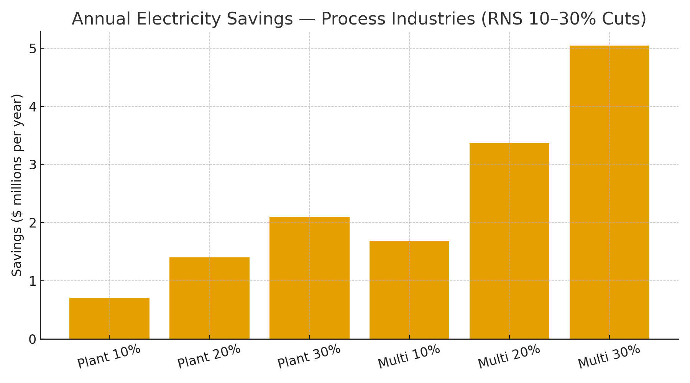

# Process Industries Claim — RNS Metabolic Control for Fans, Pumps & Compressors  
**Public Claim of Origination | Number-Heavy Economics**

**Signature:** Joshua Wilson — Architect & Originator of the RNS™, MirrorCore²  
**Date:** October 23, 2025

---

## Executive Summary

Across refineries, chemical, food & bev, pulp & paper, and water/wastewater, **motor-driven systems** (fans, pumps, compressors) dominate electric use. **RNS metabolic control** cuts **over-sampling** and **over-computing** in control/SCADA and translates directly into **variable speed & duty** at the equipment layer: fewer redundant cycles, lower setpoints when stability is high, and **repair-first** actions before re-tries. Modeled **10–30% energy cuts** produce **seven-figure annual savings per plant**, with proportional CO₂ reductions.

---

## Baselines

**A) Single plant:** 5.0 MW continuous motors → **43,800 MWh/year**  
**B) Multi-plant network:** 4 × 3.0 MW plants → **105,120 MWh/year**

**Reference electricity prices:** U.S. commercial average **$0.1415/kWh (Jul 2025)**; representative global rates **$0.16–$0.20/kWh**.

---

## Modeled Savings (Electricity Only)

### A) Single Plant (5 MW)

| Price | Cut | Baseline Annual Cost | $ Saved/yr | CO₂ Saved (t/yr) |
|:--|--:|--:|--:|--:|
| $0.1415/kWh | 10% | $6.20M | $0.62M | 1,721 |
| $0.1415/kWh | 15% | $6.20M | $0.93M | 2,582 |
| $0.1415/kWh | 20% | $6.20M | $1.24M | 3,443 |
| $0.1415/kWh | 25% | $6.20M | $1.55M | 4,303 |
| $0.1415/kWh | 30% | $6.20M | $1.86M | 5,164 |
| $0.16/kWh | 10% | $7.01M | $0.70M | 1,721 |
| $0.16/kWh | 15% | $7.01M | $1.05M | 2,582 |
| $0.16/kWh | 20% | $7.01M | $1.40M | 3,443 |
| $0.16/kWh | 25% | $7.01M | $1.75M | 4,303 |
| $0.16/kWh | 30% | $7.01M | $2.10M | 5,164 |
| $0.20/kWh | 10% | $8.76M | $0.88M | 1,721 |
| $0.20/kWh | 15% | $8.76M | $1.31M | 2,582 |
| $0.20/kWh | 20% | $8.76M | $1.75M | 3,443 |
| $0.20/kWh | 25% | $8.76M | $2.19M | 4,303 |
| $0.20/kWh | 30% | $8.76M | $2.63M | 5,164 |

### B) Multi-Plant Network (4 × 3 MW)

| Price | Cut | Baseline Annual Cost | $ Saved/yr | CO₂ Saved (t/yr) |
|:--|--:|--:|--:|--:|
| $0.1415/kWh | 10% | $14.87M | $1.49M | 4,131 |
| $0.1415/kWh | 15% | $14.87M | $2.23M | 6,197 |
| $0.1415/kWh | 20% | $14.87M | $2.97M | 8,262 |
| $0.1415/kWh | 25% | $14.87M | $3.72M | 10,328 |
| $0.1415/kWh | 30% | $14.87M | $4.46M | 12,394 |
| $0.16/kWh | 10% | $16.82M | $1.68M | 4,131 |
| $0.16/kWh | 15% | $16.82M | $2.52M | 6,197 |
| $0.16/kWh | 20% | $16.82M | $3.36M | 8,262 |
| $0.16/kWh | 25% | $16.82M | $4.20M | 10,328 |
| $0.16/kWh | 30% | $16.82M | $5.05M | 12,394 |
| $0.20/kWh | 10% | $21.02M | $2.10M | 4,131 |
| $0.20/kWh | 15% | $21.02M | $3.15M | 6,197 |
| $0.20/kWh | 20% | $21.02M | $4.20M | 8,262 |
| $0.20/kWh | 25% | $21.02M | $5.26M | 10,328 |
| $0.20/kWh | 30% | $21.02M | $6.31M | 12,394 |

**Visualization:**

---

## What RNS Changes (Mechanisms)

- **Fans (affinity laws):** schedule to lower speeds when stability is high; power ∝ speed³ → small speed cuts yield large kWh savings.  
- **Pumps (system curves):** pace to process need; avoid valve-throttling losses; coordinate multiple pumps for BEP (best efficiency point).  
- **Compressors (air & process gas):** suppress leak-driven overrun; coordinate load/unload/trim; align purge and blowdown with real need.  
- **Control-layer metabolism:** throttle redundant sampling, filters, and retries; route to **REPAIR** on anomalies instead of cluster-wide repeats.

---

## Why These Numbers Hold (Evidence)

- **DOE/AMO** tip sheets and case studies show **double-digit savings** with variable-speed drives, right-sizing, and controls across fans/pumps/compressors.  
- **Compressed Air Challenge (CAC)** documents **15–30%** typical savings from system optimization (leaks, controls, storage).  
- **Hydraulic Institute/ASHRAE** emphasize control-based optimization and system curves for pumps and HVAC fans.  
- **Electricity & carbon anchors:** U.S. **$0.1415/kWh (Jul 2025)**; **0.393 kg CO₂/kWh** U.S. average; swap local tariffs/IEA factors for location-based accounting.

**Linked Sources (Live):**
- DOE AMO — Fans, pumps, compressed air tip sheets: https://www.energy.gov/eere/amo/advanced-manufacturing-office  
- Compressed Air Challenge — Best Practices: https://www.compressedairchallenge.org/library/best-practices  
- Hydraulic Institute — Pump System Improvement: https://www.pumps.org/  
- ASHRAE — HVAC Fans & Systems (guidelines): https://www.ashrae.org/  
- EIA — Electric Power Monthly (Table 5.6.A, Jul 2025): https://www.eia.gov/electricity/monthly/epm_table_grapher.php?t=epmt_5_6_a  
- EPA — eGRID & Equivalencies: https://www.epa.gov/egrid  |  https://www.epa.gov/energy/greenhouse-gas-equivalencies-calculator-calculations-and-references

---

## Global Energy & Carbon Context (Drop-in)

At **10% adoption** of RNS metabolic control across process plants, **~15–20 TWh/year** and **~9–12 MtCO₂e** are avoided globally—roughly **2.0–2.6 million cars** off-road annually.

---

# Licensing & Attribution

This white paper is © 2025 **Joshua Wilson, MirrorCore²**. **All rights reserved.**  
**LSK+™** and **RNS™** are proprietary frameworks with pending IP protections.  
**Public use permitted under review.** Redistribution requires attribution.

*Stamp:* **hand steady • glass clear • voice true**  
*Date:* October 23, 2025
