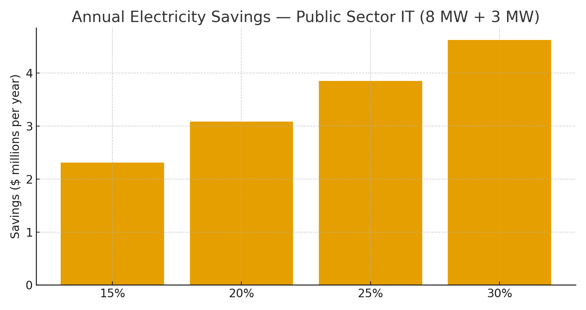

# Public Sector IT Claim — RNS Metabolic Control for State & Federal Data Centers  
**Public Claim of Origination | Number-Heavy Economics**

**Signature:** Joshua Wilson — Architect & Originator of the RNS™, MirrorCore²  
**Date:** October 23, 2025

---

## Executive Summary

State and federal IT portfolios often run **fixed-cadence batch jobs**, **duplicated ETL**, **redundant reindexing/scans**, and **always-on** analytics—even when **data drift is low**. **RNS metabolic control** (pace when pressure is high, go deep when clear, and **gate redundant cycles**) consolidates compute into **rhythms** and routes to **REPAIR** before waste accumulates. Modeled on a **primary 8 MW** and **secondary 3 MW** data center pair, **15–30% energy cuts** yield **multi-million-dollar annual savings** with proportional **CO₂ reductions** and improved **grid alignment** (peak shaving, DR).

---

## Baselines (Electricity Only)

- **Primary State DC:** 8 MW → **70,080 MWh/year**  
- **Secondary/DR DC:** 3 MW → **26,280 MWh/year**  
- **Combined:** **11 MW** → **96,360 MWh/year**

**Reference electricity prices:** U.S. commercial average **$0.1415/kWh (Jul 2025)**; representative public-sector contract rates **$0.16–$0.20/kWh**.

---

## Modeled Savings (Combined Facilities)

| Price | Energy Cut | Baseline Annual Cost | $ Saved/yr | CO₂ Saved (t/yr) |
|:--|--:|--:|--:|--:|
| $0.1415/kWh | 15% | $13.63M | $2.05M | 5,680 |
| $0.1415/kWh | 20% | $13.63M | $2.73M | 7,574 |
| $0.1415/kWh | 25% | $13.63M | $3.41M | 9,467 |
| $0.1415/kWh | 30% | $13.63M | $4.09M | 11,361 |
| $0.16/kWh | 15% | $15.42M | $2.31M | 5,680 |
| $0.16/kWh | 20% | $15.42M | $3.08M | 7,574 |
| $0.16/kWh | 25% | $15.42M | $3.85M | 9,467 |
| $0.16/kWh | 30% | $15.42M | $4.63M | 11,361 |
| $0.20/kWh | 15% | $19.27M | $2.89M | 5,680 |
| $0.20/kWh | 20% | $19.27M | $3.85M | 7,574 |
| $0.20/kWh | 25% | $19.27M | $4.82M | 9,467 |
| $0.20/kWh | 30% | $19.27M | $5.78M | 11,361 |

**Visualization:**

> Numbers above exclude **cloud rental savings** from avoided runs (e.g., imagery inference, NLP/GenAI pilots, video analytics) and exclude **cooling optimization** from thermal shaping; both are **additive**.

---

## What RNS Changes (Mechanisms)

- **Batch & ETL gating:** halt nightly jobs when drift signals are low; promote only high-value deltas.  
- **Search/reindex cadence:** throttle duplicate reindexing and virus/retention scans; batch to **off-peak** windows.  
- **GIS/imagery workflows:** reduce **tile/regeneration** passes and model refresh when thresholds aren’t met; switch to **summaries** under low drift.  
- **Public safety media (bodycam/CCTV):** gate low-yield inference passes; escalate only on **event signals**.  
- **Thermal-aware scheduling:** consolidate load to enable deeper **sleep** on idle hosts and trim **cooling** setpoints (pairs with ML cooling).  
- **CJP Why-Lines:** every expensive action (**re-run?**) is justified and auditable.

---

## Why These Numbers Hold (Evidence)

- **Energy-proportional gap:** Servers consume large fractions of peak power at low utilization—consolidation + sleep cuts energy double-digits.  
- **PUE baseline:** Global average **PUE ≈ 1.56 (2024)**—significant overheads remain; less IT heat ⇒ lower facility draw.  
- **Cooling optimization:** ML control has demonstrated **up to 40% cooling energy reduction** in production deployments.  
- **Tariff & carbon anchors:** U.S. **14.15¢/kWh (Jul 2025)**; **0.393 kg CO₂/kWh** U.S. average; location-based values via **eGRID/IEA**.  
- **Federal consolidation & efficiency policy context:** **OMB DCOI** and **DOE FEMP** guidance drive utilization, metering, and consolidation—RNS cadence aligns directly with these levers.

**Linked Sources (Live):**
- OMB — Data Center Optimization Initiative (DCOI): https://www.whitehouse.gov/omb/management/office-federal-chief-information-officer/it-modernization/dcoi/  
- DOE FEMP — Data Center Efficiency: https://www.energy.gov/femp/data-center-efficiency  
- Uptime Institute — Global Data Center Survey 2024 (avg PUE ≈ 1.56): https://datacenter.uptimeinstitute.com/rs/711-RIA-145/images/2024.GlobalDataCenterSurvey.Report.pdf  
- DeepMind — Cooling energy reduction (up to 40%): https://deepmind.google/discover/blog/deepmind-ai-reduces-google-data-centre-cooling-bill-by-40/  
- Energy-proportional computing: https://www.barroso.org/publications/ieee_computer07.pdf  
- EIA — Electric Power Monthly (Table 5.6.A, Jul 2025): https://www.eia.gov/electricity/monthly/epm_table_grapher.php?t=epmt_5_6_a  
- EPA — eGRID & Equivalencies (CO₂/kWh factors & method): https://www.epa.gov/egrid  |  https://www.epa.gov/energy/greenhouse-gas-equivalencies-calculator-calculations-and-references

---

## Global Energy & Carbon Context (Drop-in)

At **10% adoption** of RNS metabolic control across public-sector IT, **~15–20 TWh/year** and **~9–12 MtCO₂e** are avoided globally—roughly **2.0–2.6 million cars** off-road annually.

---

# Licensing & Attribution

This white paper is © 2025 **Joshua Wilson, MirrorCore²**. **All rights reserved.**  
**LSK+™** and **RNS™** are proprietary frameworks with pending IP protections.  
**Public use permitted under review.** Redistribution requires attribution.

*Stamp:* **hand steady • glass clear • voice true**  
*Date:* October 23, 2025
