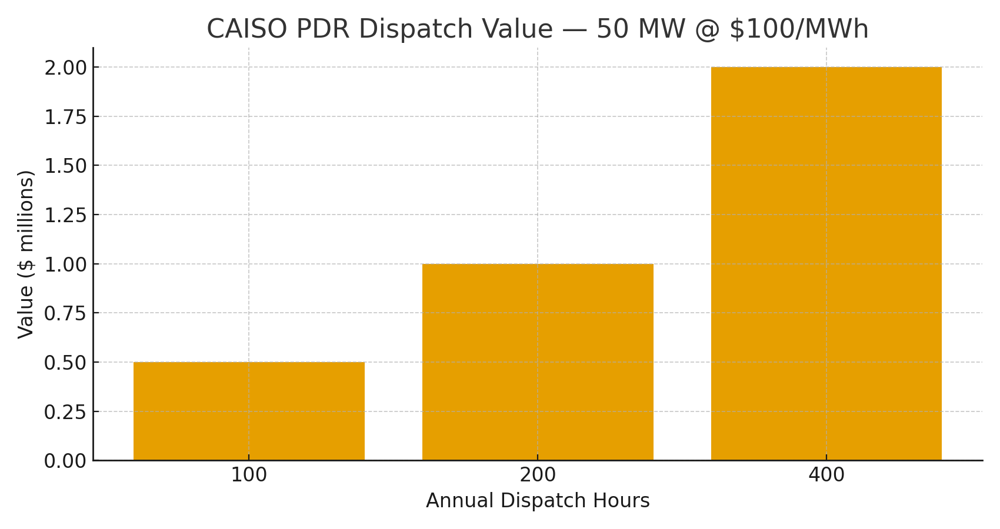

# RNS Coherence Economy — CAISO Playbook (Two-Pager)
**Date:** October 23, 2025  
**Anchor:** hand steady • glass clear • voice true

---

## 1) Why CAISO?
CAISO offers **Proxy Demand Resource (PDR)** to bid aggregated flexible loads into **day-ahead/real-time energy** and in some cases **ancillary services**. RNS turns data centers and public IT fleets into **programmable flexibility** by gating low-value compute and shaping duty in cooling and support systems.

**Core mechanism:** LMC+ pacing (fewer redundant cycles), LSK+ Why-Lines (auditable gating), DriftLock repair (stability before retries).

---

## 2) Value Stack (CAISO)
**PDR Energy revenue:** Curtail during high-price hours; bid MW into DA/RT markets.  
**Utility DR / demand charges:** Campus peaks ↓ 10–30% → lower $/kW-month charges under public-sector tariffs.  
**Facility savings:** IT kWh ↓ 10–30%, cooling energy ↓ up to 10–20% (thermal shaping).

### PDR Dispatch Sensitivity (50 MW example)
Value ≈ **MW × Dispatch hours × $/MWh**

| Hours | $/MWh | Annual Value |
|:--:|:--:|--:|
| 100 | 75 | $0.38M |
| 100 | 100 | $0.50M |
| 100 | 150 | $0.75M |
| 200 | 75 | $0.75M |
| 200 | 100 | $1.00M |
| 200 | 150 | $1.50M |
| 400 | 75 | $1.50M |
| 400 | 100 | $2.00M |
| 400 | 150 | $3.00M |

**Chart:**

---

## 3) Deployment Blueprint (90 Days)
- **Weeks 1–4:** Metering, read-only Why-Lines, baseline capture.  
- **Weeks 5–8:** Enable HOLD/gating for non-critical jobs; integrate PDR telemetry; trial DA bids with conservative MW.  
- **Weeks 9–12:** Expand dispatch windows; integrate thermal shaping; finalize settlement data pipeline.

**SLAs & KPIs:** IT kWh ↓ ≥15% (stretch 30%); peak kW ↓ ≥10%; critical job SLO ≥99.9%; false suppress ≤0.1%  
**Audit:** CJP Why-Lines; meter traces; CAISO settlement extracts.

---

## 4) Policy & Compliance Fit
- **Resource Adequacy:** Pair with RA providers if capacity attributes are contracted; RNS primarily targets **energy/ancillary** via PDR.  
- **Security (FedRAMP/FISMA/NIST 800-53)**: Observability without accessing data content.  
- **Privacy/Records:** NARA schedules; retention ≥ 1 year.

---

## 5) Linked Sources (Live)
- CAISO — Proxy Demand Resource (program overview & participation): https://www.caiso.com/library/demand-response-proxy-demand-resource  
- CAISO — PDR/RDRR participation deck (rules, min size): https://www.caiso.com/documents/pdr_rdrrparticipationoverviewpresentation.pdf  
- DOE — Grid-Interactive Efficient Buildings (GEB): https://www.energy.gov/eere/buildings/grid-interactive-efficient-buildings  
- LBNL — Demand charge primers: https://eta-publications.lbl.gov/sites/default/files/report-lbnl-57942.pdf

---

### Licensing & Attribution
© 2025 **Joshua Wilson, MirrorCore²**. All rights reserved. **RNS™**, **LSK+™**. Public use permitted under review; redistribution requires attribution.
