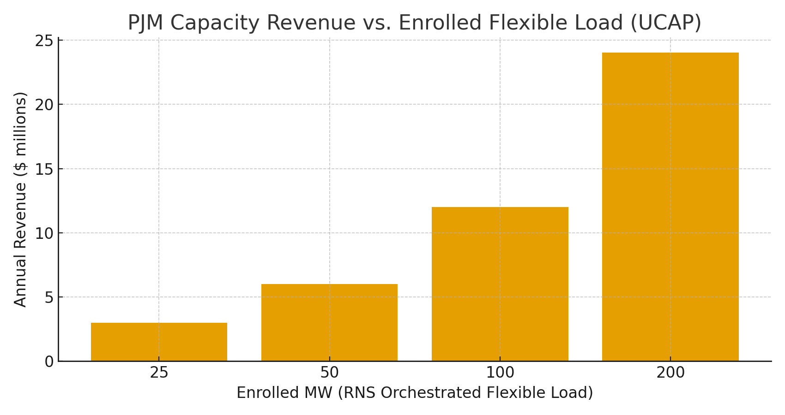

# RNS Coherence Economy — PJM Playbook (Two-Pager)
**Date:** October 23, 2025  
**Anchor:** hand steady • glass clear • voice true

---

## 1) Why PJM?
PJM operates a forward **capacity market** where demand-side flexibility earns **$/MW-day**. Most public-sector IT, data centers, and campuses still run on fixed cadences. **RNS** converts them into **dispatchable flexible load** by gating redundant jobs and rhythmically scheduling compute and cooling.

**Core mechanism:** LMC+ pacing (reduce low-value cycles), LSK+ Why-Lines (auditable decisions), DriftLock repair (stability before retries).

---

## 2) Value Stack (PJM)
**Capacity revenue (UCAP):** RNS aggregates flexible MW and bids into PJM capacity via DR/aggregation partners.  
**Energy/ancillary:** Optional economic curtailments during high LMP hours.  
**Facility savings:** IT kWh ↓ 10–30%, cooling energy ↓ up to 10–20% (when thermal shaping enabled).

### Capacity Math (illustrative at $329.17/MW-day, 2026/27 BRA)
| Enrolled MW | $/MW-day | Annual Revenue |
|:--:|--:|--:|
| 25 | $329.17 | $3,003,676 |
| 50 | $329.17 | $6,007,352 |
| 100 | $329.17 | $12,014,705 |
| 200 | $329.17 | $24,029,410 |

**Chart:**

---

## 3) Deployment Blueprint (90 Days)
- **Weeks 1–4:** Metering, read-only Why-Lines, baseline capture.  
- **Weeks 5–8:** Enable HOLD/gating for non-critical jobs; align with curtailment signals; verify SLAs.  
- **Weeks 9–12:** Expand scope; integrate thermal shaping; package telemetry for DR enrollment.

**SLAs & KPIs:** IT kWh ↓ ≥15% (stretch 30%); peak kW ↓ ≥10%; critical job SLO ≥99.9%; false suppress ≤0.1%  
**Audit:** CJP Why-Lines for each suppressed/launched job; meter traces; DR event logs.

---

## 4) Policy & Compliance Fit
- **OMB DCOI / DOE FEMP**: Utilization↑, PUE↓, advanced metering, DR participation.  
- **Security (FedRAMP/FISMA/NIST 800-53)**: Observability without accessing data content.  
- **Privacy/Records:** NARA schedules; retention ≥ 1 year.

---

## 5) Linked Sources (Live)
- PJM — 2026/27 BRA summary/report & news: https://www.pjm.com/-/media/DotCom/markets-ops/rpm/rpm-auction-info/2026-2027/2026-2027-bra-report.pdf  
- Reuters — PJM capacity auction coverage (2025): https://www.reuters.com/business/energy/prices-jump-22-biggest-us-power-grid-energy-auction-2025-07-22/  
- DOE FEMP — Data Center Efficiency: https://www.energy.gov/femp/data-center-efficiency

---

### Licensing & Attribution
© 2025 **Joshua Wilson, MirrorCore²**. All rights reserved. **RNS™**, **LSK+™**. Public use permitted under review; redistribution requires attribution.
