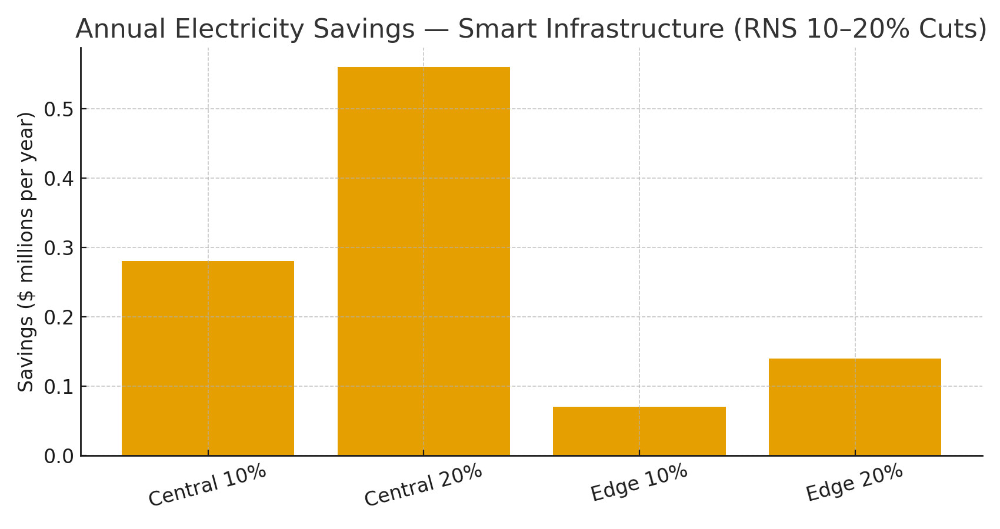

# Smart Infrastructure Claim — RNS Rhythmic Balance for Digital Twins & IoT  
**Public Claim of Origination | Number-Heavy Economics**

**Signature:** Joshua Wilson — Architect & Originator of the RNS™, MirrorCore²  
**Date:** October 23, 2025

---

## Executive Summary

Smart infrastructure stacks—**grid management**, **climate/digital-twin simulation**, and **logistics routing**—suffer from **over-sampling** and **over-computing**. The **RNS recursive balance** ties energy to control, suppressing redundant prediction cycles and aligning compute cadence with information value. Modeled across a **city-scale digital twin (2 MW)** and **aggregated edge/IoT (0.5 MW)**, **10–20% energy cuts** yield **six- to seven-figure annual savings** and proportional **CO₂ reductions**—without hardware replacement.

---

## Baseline Scenarios

**A) City Digital Twin (central compute):** 2.0 MW continuous → **17,520 MWh/year**  
**B) Aggregated Edge/IoT compute:** 0.5 MW continuous → **4,380 MWh/year**

**Reference prices:** U.S. commercial average **$0.1415/kWh (Jul 2025)**; representative global rates **$0.16–$0.20/kWh**.

---

## Modeled Savings (Electricity Only)

| Price | Cut | Central Base ($/yr) | Central $ Saved/yr | Central CO₂ Saved (t/yr) | Edge Base ($/yr) | Edge $ Saved/yr | Edge CO₂ Saved (t/yr) |
|:--|--:|--:|--:|--:|--:|--:|--:|
| $0.1415/kWh | 10% | $2.48M | $0.25M | 689 | $0.62M | $0.06M | 172 |
| $0.1415/kWh | 15% | $2.48M | $0.37M | 1,033 | $0.62M | $0.09M | 258 |
| $0.1415/kWh | 20% | $2.48M | $0.50M | 1,377 | $0.62M | $0.12M | 344 |
| $0.16/kWh | 10% | $2.80M | $0.28M | 689 | $0.70M | $0.07M | 172 |
| $0.16/kWh | 15% | $2.80M | $0.42M | 1,033 | $0.70M | $0.11M | 258 |
| $0.16/kWh | 20% | $2.80M | $0.56M | 1,377 | $0.70M | $0.14M | 344 |
| $0.20/kWh | 10% | $3.50M | $0.35M | 689 | $0.88M | $0.09M | 172 |
| $0.20/kWh | 15% | $3.50M | $0.53M | 1,033 | $0.88M | $0.13M | 258 |
| $0.20/kWh | 20% | $3.50M | $0.70M | 1,377 | $0.88M | $0.18M | 344 |

**Visualization:**

> These figures exclude compute-time savings (e.g., cloud cycles avoided) and operational gains from **fewer retries** and **shorter queues**; those are additive.

---

## Why These Numbers Are Credible (Evidence)

- **Digital twins are compute-intensive:** City/utility-scale twins run continuous physics + ML pipelines (NVIDIA Omniverse, Siemens) with 24/7 workloads; small percentage cuts translate into large kWh.  
- **Energy-proportionality gap:** Servers draw significant power when underutilized; consolidating cycles and adding sleep states delivers double-digit reductions—creating headroom for RNS’s rhythmic gating.  
- **Grid/DR alignment:** Scheduling non-urgent predictions to off-peak windows reduces **peak draw** and **cooling load**, echoing proven demand-response strategies in data centers.  
- **Electricity & carbon anchors:** U.S. **commercial average price 14.15¢/kWh (Jul 2025)**; **CO₂ intensity ~0.393 kg/kWh** (U.S. avg). Users can swap local tariffs and **eGRID/IEA** intensities for location-based accounting.

**Linked Sources (Live):**
- NVIDIA Omniverse & digital twins overview: https://developer.nvidia.com/omniverse  
- Siemens Digital Industries — Digital twin in grid/industry: https://www.siemens.com/global/en/products/automation/topic-areas/digital-twin.html  
- Barroso & Hölzle — Energy-Proportional Computing: https://www.barroso.org/publications/ieee_computer07.pdf  
- PowerNap — Eliminating Server Idle Power: https://www.researchgate.net/publication/220939094_PowerNap_Eliminating_Server_Idle_Power  
- Uptime Institute — Global Data Center Survey 2024 (avg PUE ≈ 1.56): https://datacenter.uptimeinstitute.com/rs/711-RIA-145/images/2024.GlobalDataCenterSurvey.Report.pdf  
- EIA — Electric Power Monthly (Table 5.6.A, Jul 2025): https://www.eia.gov/electricity/monthly/epm_table_grapher.php?t=epmt_5_6_a  
- EPA — eGRID & Equivalencies (CO₂/kWh factors & method): https://www.epa.gov/egrid  |  https://www.epa.gov/energy/greenhouse-gas-equivalencies-calculator-calculations-and-references  
- Demand response & workload shifting examples (industry): https://www.reuters.com/sustainability/boards-policy-regulation/google-agrees-curb-power-use-ai-data-centers-ease-strain-us-grid-when-demand-2025-08-04/

---

## Global Energy & Carbon Context (Drop-in)

At **10% adoption** of RNS metabolic scheduling across AI/digital twin/IoT fleets, the world avoids **~15–20 TWh/year** and **~9–12 MtCO₂e**, equivalent to **~2.0–2.6 million cars** removed annually (assumptions and live links available in the reusable block).

---

# Licensing & Attribution

This white paper is © 2025 **Joshua Wilson, MirrorCore²**. **All rights reserved.**  
**LSK+™** and **RNS™** are proprietary frameworks with pending IP protections.  
**Public use permitted under review.** Redistribution requires attribution.

*Stamp:* **hand steady • glass clear • voice true**  
*Date:* October 23, 2025
